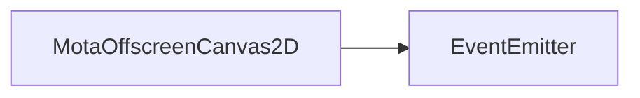

# MotaOffscreenCanvas2D 类 API 文档

以下内容由 `DeepSeek R1` 模型生成并微调。

---

## 继承关系



---

## 属性说明

| 属性名           | 类型                       | 默认值   | 说明                                        |
| ---------------- | -------------------------- | -------- | ------------------------------------------- |
| `canvas`         | `HTMLCanvasElement`        | -        | 关联的 HTML 画布元素                        |
| `ctx`            | `CanvasRenderingContext2D` | -        | 画布的 2D 渲染上下文                        |
| `width`          | `number`                   | 自动计算 | 画布的逻辑宽度（不包含缩放比例）            |
| `height`         | `number`                   | 自动计算 | 画布的逻辑高度（不包含缩放比例）            |
| `autoScale`      | `boolean`                  | `false`  | 是否自动跟随 `core.domStyle.scale` 进行缩放 |
| `highResolution` | `boolean`                  | `true`   | 是否启用高清画布（根据设备像素比例缩放）    |
| `antiAliasing`   | `boolean`                  | `true`   | 是否启用抗锯齿                              |
| `scale`          | `number`                   | `1`      | 当前画布的缩放比例                          |
| `symbol`         | `number`                   | `0`      | 更新标识符，值变化表示画布被被动清空或调整  |
| `freezed`        | `boolean`（只读）          | `false`  | 当前画布是否被冻结（冻结后不可修改属性）    |
| `active`         | `boolean`（只读）          | `true`   | 当前画布是否处于激活状态                    |

---

## 构造方法

### `constructor`

```ts
function constructor(
    alpha: boolean = true,
    canvas?: HTMLCanvasElement
): MotaOffscreenCanvas2D;
```

**描述**  
创建一个新的离屏画布。  
**参数**

- `alpha`: 是否启用透明度通道（默认为 `true`）。
- `canvas`: 可指定现有画布，未提供时自动创建新画布。  
  **注意**
- 在自定义渲染元素中，建议使用 `RenderItem.requireCanvas` 而非直接调用此构造函数。之后如果不使用，再使用 `RenderItem.deleteCanvas` 删除。

---

## 方法说明

### `size`

```ts
function size(width: number, height: number): void;
```

**描述**  
设置画布的尺寸。  
**参数**

- `width`: 逻辑宽度（最小为 1）。
- `height`: 逻辑高度（最小为 1）。  
  **行为**
- 自动计算缩放比例（考虑 `highResolution` 和 `autoScale`）。
- 调整画布物理尺寸和样式尺寸。

**示例**

```typescript
const canvas = new MotaOffscreenCanvas2D();
canvas.size(800, 600); // 设置画布尺寸为 800x600（逻辑尺寸）
```

---

### `withGameScale`

```ts
function withGameScale(auto: boolean): void;
```

**描述**  
设置画布是否跟随 `core.domStyle.scale` 自动缩放。  
**参数**

- `auto`: 是否启用自动缩放。

**示例**

```typescript
canvas.withGameScale(true); // 启用自动缩放
```

---

### `setHD`

```ts
function setHD(hd: boolean): void;
```

**描述**  
设置是否为高清画布（基于设备像素比例）。  
**参数**

- `hd`: 是否启用高清模式。

**示例**

```typescript
canvas.setHD(false); // 关闭高清模式
```

---

### `setAntiAliasing`

```ts
function setAntiAliasing(anti: boolean): void;
```

**描述**  
设置抗锯齿功能。  
**参数**

- `anti`: 是否启用抗锯齿。

**示例**

```typescript
canvas.setAntiAliasing(false); // 关闭抗锯齿
```

---

### `clear`

```ts
function clear(): void;
```

**描述**  
清空画布内容。  
**注意**

- 冻结状态下调用此方法会触发警告。

**示例**

```typescript
canvas.clear(); // 清空画布
```

---

### `delete`

```ts
function delete(): void
```

**描述**  
删除画布，释放资源并解除 DOM 绑定。

**示例**

```typescript
canvas.delete(); // 删除画布
```

---

### `freeze`

```ts
function freeze(): void;
```

**描述**  
冻结画布，禁止修改属性，并从全局列表中移除。

**示例**

```typescript
canvas.freeze(); // 冻结画布
```

---

### `activate`

```ts
function activate(): void;
```

**描述**  
激活画布，使其跟随游戏缩放调整尺寸。

**示例**

```typescript
canvas.activate(); // 激活画布
```

---

### `deactivate`

```ts
function deactivate(): void;
```

**描述**  
停用画布，不再自动调整尺寸，可能被垃圾回收。

**示例**

```typescript
canvas.deactivate(); // 停用画布
```

---

## 静态方法说明

### `MotaOffscreenCanvas2D.clone`

```ts
function clone(canvas: MotaOffscreenCanvas2D): MotaOffscreenCanvas2D;
```

**描述**  
复制一个画布对象，结果画布将被冻结。  
**返回值**

- 复制的画布对象（不可修改属性，但可绘制）。

**示例**

```typescript
const cloned = MotaOffscreenCanvas2D.clone(sourceCanvas); // 复制画布
```

---

### `MotaOffscreenCanvas2D.refreshAll`

```ts
function refreshAll(force: boolean = false): void;
```

**描述**  
刷新所有已注册画布的尺寸（仅在窗口大小变化时自动调用）。  
**参数**

- `force`: 是否强制刷新所有画布（默认仅刷新启用 `autoScale` 的画布）。

---

## 事件类型

### `resize`

**触发时机**  
当画布被动调整尺寸时触发（例如窗口大小变化或 `core.domStyle.scale` 变化）。

**监听示例**

```typescript
canvas.on('resize', () => {
    console.log('画布尺寸已调整');
});
```

---

## 使用示例

```typescript
// 创建画布
const canvas = new MotaOffscreenCanvas2D();

// 配置属性
canvas.size(800, 600);
canvas.withGameScale(true);
canvas.setHD(true);

// 监听调整事件
canvas.on('resize', () => {
    console.log('画布尺寸已更新');
});

// 绘制内容
canvas.ctx.fillStyle = 'red';
canvas.ctx.fillRect(0, 0, canvas.width, canvas.height);

// 冻结画布
canvas.freeze();

// 复制画布
const cloned = MotaOffscreenCanvas2D.clone(canvas);
```
