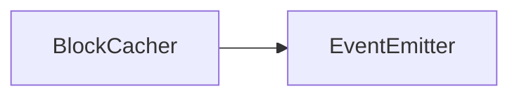

# BlockCacher API 文档

本文档由 `DeepSeek R1` 模型生成并微调。

---



_继承自 `EventEmitter<BlockCacherEvent>`，支持事件监听。_

---

## 属性说明

| 属性名       | 类型             | 描述                                                                |
| ------------ | ---------------- | ------------------------------------------------------------------- |
| `width`      | `number`         | 区域总宽度（元素单位）                                              |
| `height`     | `number`         | 区域总高度（元素单位）                                              |
| `blockSize`  | `number`         | 单个分块的大小（元素单位）                                          |
| `blockData`  | `BlockData`      | 分块计算结果（包含分块数量、最后一个块的尺寸等信息）                |
| `cacheDepth` | `number`         | 缓存深度（每个分块可存储多个缓存层）                                |
| `cache`      | `Map<number, T>` | 缓存存储结构，键为精确索引（`(x + y * blockWidth) * depth + deep`） |

---

## 构造方法

### `constructor`

```typescript
function constructor(
    width: number,
    height: number,
    size: number,
    depth?: number
): BlockCacher<T>;
```

创建分块缓存管理器并自动计算初始分块。  
**示例：**

```typescript
const cacher = new BlockCacher<ICanvasCacheItem>(800, 600, 64); // 800x600区域，64为分块大小
```

---

## 方法说明

### `size`

```typescript
function size(width: number, height: number): void;
```

重置区域尺寸并重新分块（触发 `split` 事件）。  
**示例：**

```typescript
cacher.size(1024, 768); // 重置为1024x768区域
```

### `setBlockSize`

```typescript
function setBlockSize(size: number): void;
```

修改分块尺寸并重新分块（触发 `split` 事件）。  
**示例：**

```typescript
cacher.setBlockSize(128); // 分块大小改为128
```

### `setCacheDepth`

```typescript
function setCacheDepth(depth: number): void;
```

调整缓存深度（最大 31），自动迁移旧缓存。  
**示例：**

```typescript
cacher.setCacheDepth(3); // 每个分块支持3层缓存
```

### `split`

```typescript
function split(): void;
```

重新计算分块数据并触发 `'split'` 事件。  
**示例：**

```typescript
cacher.split(); // 手动触发分块计算（一般无需调用）
```

### `clearCache`

```typescript
function clearCache(index: number, deep: number): void;
```

清除指定分块索引的缓存（按二进制掩码清除深度）。  
**示例：**

```typescript
cacher.clearCache(5, 0b101); // 清除分块5的第0层和第2层缓存
```

### `clearCacheByIndex`

```typescript
function clearCacheByIndex(index: number): void;
```

直接按精确索引清除单个缓存。  
**示例：**

```typescript
cacher.clearCacheByIndex(42); // 清除精确索引42对应的缓存
```

### `clearAllCache`

```typescript
function clearAllCache(): void;
```

清空所有缓存并销毁关联资源。  
**示例：**

```typescript
cacher.clearAllCache(); // 完全重置缓存
```

### `getIndex`

```typescript
function getIndex(x: number, y: number): number;
```

根据分块坐标获取分块索引（分块坐标 -> 分块索引）。  
**示例：**

```typescript
const index = cacher.getIndex(2, 3); // 获取(2,3)分块的索引
```

### `getIndexByLoc`

```typescript
function getIndexByLoc(x: number, y: number): number;
```

根据元素坐标获取所属分块索引（元素坐标 -> 分块索引）。  
**示例：**

```typescript
const index = cacher.getIndexByLoc(150, 200); // 元素坐标(150,200)所在分块索引
```

### `getBlockXYByIndex`

```typescript
function getBlockXYByIndex(index: number): [number, number];
```

根据分块索引获取分块坐标（分块索引 -> 分块坐标）。  
**示例：**

```typescript
const [x, y] = cacher.getBlockXYByIndex(5); // 分块5的坐标
```

### `getBlockXY`

```typescript
function getBlockXY(x: number, y: number): [number, number];
```

获取一个元素位置所在的分块位置（即使它不在任何分块内）（元素索引 -> 分块坐标）。  
**示例：**

```typescript
const [x, y] = cacher.getBlockXY(11, 24); // 指定位置所在分块位置
```

### `getPreciseIndex`

```typescript
function getPreciseIndex(x: number, y: number, deep: number): number;
```

根据分块坐标与 `deep` 获取一个分块的精确索引（分块坐标 -> 分块索引）。  
**示例：**

```typescript
const index = cacher.getPreciseIndex(2, 1, 3); // 指定分块的索引
```

### `getPreciseIndexByLoc`

```typescript
function getPreciseIndexByLoc(x: number, y: number, deep: number): number;
```

根据元素坐标及 `deep` 获取元素所在块的精确索引（元素坐标 -> 分块索引）。  
**示例：**

```typescript
const index = cacher.getPreciseIndexByLoc(22, 11, 3); // 指定元素所在分块的索引
```

### `updateElementArea`

```typescript
function updateElementArea(
    x: number,
    y: number,
    width: number,
    height: number,
    deep: number = 2 ** 31 - 1
): Set<number>;
```

根据元素区域清除相关分块缓存（返回受影响的分块索引集合）（元素坐标->分块清空）。  
**示例：**

```typescript
const blocks = cacher.updateElementArea(100, 100, 200, 200); // 清除200x200区域内的缓存
```

### `updateArea`

```typescript
function updateArea(
    x: number,
    y: number,
    width: number,
    height: number,
    deep: number = 2 ** 31 - 1
): Set<number>;
```

更新指定分块区域内的缓存（注意坐标是分块坐标，而非元素坐标）（分块坐标->分块清空）。  
**示例：**

```typescript
const blocks = cacher.updateArea(1, 1, 1, 1); // 清除指定分块区域内的缓存
```

### `getIndexOf`

```typescript
function getIndexOf(
    x: number,
    y: number,
    width: number,
    height: number
): Set<number>;
```

传入分块坐标与范围，获取该区域内包含的所有分块索引（分块坐标->分块索引集合）。  
**示例：**

```typescript
const blocks = cacher.getIndexOf(1, 1, 1, 1); // 清除指定分块区域内的缓存
```

### `getIndexOfElement`

```typescript
function getIndexOfElement(
    x: number,
    y: number,
    width: number,
    height: number
): Set<number>;
```

传入元素坐标与范围，获取该区域内包含的所有分块索引（元素坐标->分块索引集合）。  
**示例：**

```typescript
const blocks = cacher.getIndexOfElement(3, 5, 12, 23); // 清除指定元素区域内的缓存
```

### `getRectOfIndex`

```typescript
function getRectOfIndex(block: number): [number, number, number, number];
```

获取分块索引对应的元素坐标范围（分块索引 -> 元素矩形坐标）。  
**示例：**

```typescript
const [x1, y1, x2, y2] = cacher.getRectOfIndex(5); // 分块5的坐标范围
```

### `getRectOfBlockXY`

```typescript
function getRectOfBlockXY(
    x: number,
    y: number
): [number, number, number, number];
```

根据分块坐标，获取这个分块所在区域的元素矩形范围（左上角横纵坐标及右下角横纵坐标）（分块坐标 -> 元素矩形坐标）。  
**示例：**

```typescript
const [x1, y1, x2, y2] = cacher.getRectOfIndex(5); // 分块5的坐标范围
```

### `destroy`

```typescript
function destroy(): void;
```

摧毁这个块缓存。

---

## 事件说明

| 事件名  | 参数 | 描述               |
| ------- | ---- | ------------------ |
| `split` | 无   | 分块参数变更时触发 |

---

## 总使用示例

```typescript
// 创建缓存管理器
const cacheManager = new BlockCacher<ICanvasCacheItem>(1024, 768, 64);

// 监听分块变化
cacheManager.on('split', () => {
    console.log('分块已重新计算');
});

// 添加测试缓存项
const blockIndex = cacheManager.getIndex(2, 3);
const preciseIndex = cacheManager.getPreciseIndex(2, 3, 0);
cacheManager.cache.set(
    preciseIndex,
    new CanvasCacheItem(new MotaOffscreenCanvas2D(), 1)
);

// 清除特定区域缓存
cacheManager.updateElementArea(150, 150, 100, 100);

// 销毁管理器
cacheManager.destroy();
```
