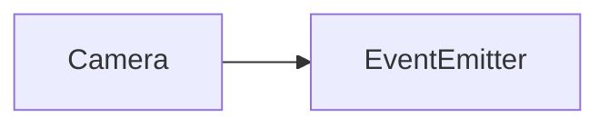

# Camera API 文档

本文档由 `DeepSeek R1` 模型生成并微调。

---



_继承自 `EventEmitter<CameraEvent>`，支持事件监听。_

---

## 属性说明

| 属性名                | 类型                | 描述                                             |
| --------------------- | ------------------- | ------------------------------------------------ |
| `readonly binded`     | `RenderItem`        | 当前绑定的渲染元素                               |
| `transform`           | `Transform`         | 目标变换矩阵，默认与 `binded.transform` 共享引用 |
| `protected operation` | `CameraOperation[]` | 当前应用的变换操作列表（平移/旋转/缩放）         |

---

## 构造方法

### `Camera.for`

```typescript
 function for(item: RenderItem): Camera
```

获取或创建与渲染元素关联的摄像机实例。  
**示例：**

```typescript
const item = new RenderItem();
const camera = Camera.for(item); // 获取或创建摄像机
```

### `constructor`

```typescript
function constructor(item: RenderItem): Camera;
```

直接创建摄像机实例（不会自动注册到全局映射）。  
**注意：** 推荐优先使用 `Camera.for()` 方法。

---

## 方法说明

### `disable`

```typescript
function disable(): void;
```

禁用摄像机变换效果。  
**示例：**

```typescript
camera.disable(); // 暂停所有摄像机变换
```

### `enable`

```typescript
function enable(): void;
```

启用摄像机变换效果。

### `requestUpdate`

```typescript
function requestUpdate(): void;
```

请求在下一帧强制更新变换矩阵。

### `removeOperation`

```typescript
function removeOperation(operation: CameraOperation): void;
```

移除一个变换操作。
**参数说明**

-   `operation`: 要移除的操作

**示例**

```ts
const operation = camera.addTranslate();
camera.removeOperation(operation);
```

### `clearOperation`

```ts
function clearOperation(): void;
```

清空变换操作列表。

### `addTranslate`

```typescript
function addTranslate(): ICameraTranslate;
```

添加平移操作并返回操作对象。  
**示例：**

```typescript
const translateOp = camera.addTranslate();
translateOp.x = 100; // 设置横向偏移
camera.requestUpdate();
```

### `addRotate`

```typescript
function addRotate(): ICameraRotate;
```

添加旋转操作并返回操作对象。  
**示例：**

```typescript
const rotateOp = camera.addRotate();
rotateOp.angle = Math.PI / 2; // 设置90度旋转
camera.requestUpdate();
```

### `addScale`

```typescript
function addScale(): ICameraScale;
```

添加缩放操作并返回操作对象。  
**示例：**

```typescript
const scaleOp = camera.addScale();
scaleOp.x = 2; // 横向放大2倍
camera.requestUpdate();
```

### `applyAnimation`

```ts
function applyAnimation(time: number, update: () => void): void;
```

施加动画。

**参数说明**

-   `time`: 动画时长。
-   `update`: 每帧执行的更新函数。

### `applyTranslateAnimation`

```typescript
function applyTranslateAnimation(
    operation: ICameraTranslate,
    animate: Animation,
    time: number
): void;
```

为平移操作绑定动画。  
**参数说明：**

-   `animate`: 预定义的动画实例
-   `time`: 动画持续时间（毫秒）

### `applyRotateAnimation`

```typescript
function applyRotateAnimation(
    operation: ICameraRotate,
    animate: Animation,
    time: number
): void;
```

为旋转操作绑定动画。

### `applyScaleAnimation`

```typescript
function applyScaleAnimation(
    operation: ICameraScale,
    animate: Animation,
    time: number
): void;
```

为缩放操作绑定动画。

### `applyTranslateTransition`

```typescript
function applyTranslateTransition(
    operation: ICameraTranslate,
    animate: Transition,
    time: number
): void;
```

为平移操作绑定渐变。  
**参数说明：**

-   `animate`: 预定义的渐变实例
-   `time`: 渐变持续时间（毫秒）

### `applyRotateTransition`

```typescript
function applyRotateTransition(
    operation: ICameraRotate,
    animate: Transition,
    time: number
): void;
```

为旋转操作绑定渐变。

### `applyScaleTransition`

```typescript
function applyScaleTransition(
    operation: ICameraScale,
    animate: Transition,
    time: number
): void;
```

为缩放操作绑定渐变。

### `stopAllAnimates`

```ts
function stopAllAnimates(): void;
```

停止所有动画。

### `destroy`

```typescript
function destroy(): void;
```

销毁摄像机并释放所有资源。  
**示例：**

```typescript
camera.destroy(); // 解除绑定并清理动画
```

---

## 事件说明

| 事件名    | 参数 | 描述               |
| --------- | ---- | ------------------ |
| `destroy` | 无   | 摄像机被销毁时触发 |

---

## 总使用示例

::: code-group

```typescript [动画]
import { Animation, linear } from 'mutate-animate';

// 获取摄像机实例
const item = new Sprite();
const camera = Camera.for(item);

// 添加平移和缩放操作
const translate = camera.addTranslate();
const scale = camera.addScale();

// 创建动画实例
const anim = new Animation()
    .mode(linear())
    .time(1000)
    .move(100, 100)
    .time(800)
    .scale(1.5);

// 绑定动画
camera.applyTranslateAnimation(translate, anim, 1000);
camera.applyScaleAnimation(scale, anim, 800);

// 启用摄像机
camera.enable();

// 销毁（当不再需要时）
setTimeout(() => camera.destroy(), 2000);
```

```typescript [渐变]
import { Transition, hyper } from 'mutate-animate';
// 获取摄像机实例
const item = new Sprite();
const camera = Camera.for(item);

// 添加平移和缩放操作
const translate = camera.addTranslate();
const scale = camera.addScale();

// 创建渐变实例，使用双曲正弦速率曲线
const tran = new Transition().mode(hyper('sin', 'out')).time(1000);

// 初始化参数，这一步不会执行渐变
tran.value.x = 0;
tran.value.y = 0;
tran.value.size = 0;

// 对参数执行渐变，直接设置即可
tran.value.x = 100;
tran.value.y = 200;
tran.time(800); // 设置渐变时长为 800 毫秒
tran.value.size = 1.5;

// 绑定动画
camera.applyTranslateTransition(translate, tran, 1000);
camera.applyScaleTransition(scale, tran, 800);

// 启用摄像机
camera.enable();

// 销毁（当不再需要时）
setTimeout(() => camera.destroy(), 2000);
```

:::

---

## 接口说明

### `ICameraTranslate`

```typescript
interface ICameraTranslate {
    readonly type: 'translate';
    readonly from: RenderItem;
    x: number; // 横向偏移量
    y: number; // 纵向偏移量
}
```

### `ICameraRotate`

```typescript
interface ICameraRotate {
    readonly type: 'rotate';
    readonly from: RenderItem;
    angle: number; // 旋转弧度值
}
```

### `ICameraScale`

```typescript
interface ICameraScale {
    readonly type: 'scale';
    readonly from: RenderItem;
    x: number; // 横向缩放比
    y: number; // 纵向缩放比
}
```
