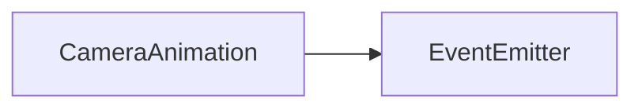

# CameraAnimation API 文档

本文档由 `DeepSeek R1` 模型生成并微调。

---



_继承自 `EventEmitter<CameraAnimationEvent>`，支持事件监听。_

---

## 属性说明

| 属性名   | 类型     | 描述             |
| -------- | -------- | ---------------- |
| `camera` | `Camera` | 关联的摄像机实例 |

---

## 构造方法

### `constructor`

```typescript
function constructor(camera: Camera): CameraAnimation;
```

创建摄像机动画管理器，需绑定到特定 `Camera` 实例。  
**示例：**

```typescript
const camera = Camera.for(renderItem);
const animation = new CameraAnimation(camera);
```

---

## 方法说明

### `translate`

```typescript
function translate(
    operation: ICameraTranslate,
    x: number,
    y: number,
    time: number,
    start: number,
    timing: TimingFn
): void;
```

为平移操作添加动画。  
**参数说明：**

-   `x`, `y`: 目标偏移量（格子坐标，自动乘以 `32`，之后可能改动）
-   `time`: 动画持续时间（毫秒）
-   `start`: 动画开始时间（相对于总动画开始的延迟）
-   `timing`: 缓动函数（输入时间完成度，输出动画完成度）

### `rotate`

```typescript
function rotate(
    operation: ICameraRotate,
    angle: number,
    time: number,
    start: number,
    timing: TimingFn
): void;
```

为旋转操作添加动画。  
**参数说明：**

-   `angle`: 目标旋转弧度（如 `Math.PI` 表示 `180` 度）
-   其余参考[`rotate`](#rotate)

### `scale`

```typescript
function scale(
    operation: ICameraScale,
    scale: number,
    time: number,
    start: number,
    timing: TimingFn
): void;
```

为缩放操作添加动画。  
**参数说明：**

-   `scale`: 目标缩放倍率（如 `1.5` 表示放大 `1.5` 倍）
-   其余参考[`rotate`](#rotate)

### `start`

```typescript
function start(): void;
```

启动所有已添加的动画，按时间顺序执行。  
**注意：** 调用后动画将按 `start` 参数定义的顺序触发。

### `destroy`

```typescript
function destroy(): void;
```

销毁动画管理器并释放所有资源（停止未完成的动画）。

---

## 事件说明

| 事件名    | 参数                                                                                                     | 描述                         |
| --------- | -------------------------------------------------------------------------------------------------------- | ---------------------------- |
| `animate` | `operation: CameraOperation` <br> `execution: CameraAnimationExecution` <br> `item: CameraAnimationData` | 当某个动画片段开始执行时触发 |

---

## 总使用示例

```typescript
import { hyper, trigo } from 'mutate-animate';

// 创建渲染元素和摄像机
const renderItem = new Sprite();
const camera = Camera.for(renderItem);

// 添加平移和旋转操作
const translateOp = camera.addTranslate();
const rotateOp = camera.addRotate();

// 创建动画管理器
const animation = new CameraAnimation(camera);

// 添加平移动画：1秒后开始，持续2秒，横向移动3格（3*32像素）
animation.translate(
    translateOp,
    3,
    0, // x=3, y=0（自动乘32）
    2000, // 动画时长2秒
    1000, // 延迟1秒开始
    hyper('sin', 'out') // 双曲正弦函数
);

// 添加旋转动画：立即开始，持续1.5秒，旋转180度
animation.rotate(
    rotateOp,
    Math.PI, // 目标角度（弧度）
    1500, // 动画时长1.5秒
    0, // 无延迟
    trigo('sin', 'out') // 正弦函数
);

// 启动动画
animation.start();

// 监听动画事件
animation.on('animate', (operation, execution, item) => {
    console.log('动画片段开始:', item.type);
});

// 销毁（动画结束后）
setTimeout(() => {
    animation.destroy();
    camera.destroy();
}, 5000);
```

---

## 接口说明

### `CameraAnimationExecution`

```typescript
interface {
  data: CameraAnimationData[];  // 动画片段列表
  animation: Animation;         // 关联的动画实例
}
```

### `CameraAnimationData`

```typescript
type CameraAnimationData =
    | TranslateAnimation
    | TranslateAsAnimation
    | RotateAnimation
    | ScaleAnimation;
```
