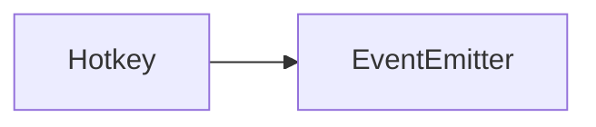

# Hotkey API 文档

本文档由 `DeepSeek R1` 模型生成并微调。



## 类描述

`Hotkey` 是按键系统的核心类，用于管理按键绑定、辅助键状态、按键分组及事件触发逻辑。继承自 `EventEmitter`，支持自定义事件监听。主要用于实现复杂的快捷键系统。

---

## 属性说明

| 属性名         | 类型                         | 描述                                         |
| -------------- | ---------------------------- | -------------------------------------------- |
| `id`           | `string`                     | 控制器的唯一标识符                           |
| `name`         | `string`                     | 控制器的显示名称                             |
| `data`         | `Record<string, HotkeyData>` | 存储所有已注册的按键配置                     |
| `keyMap`       | `Map<KeyCode, HotkeyData[]>` | 按键代码到配置的映射（支持多键绑定同一操作） |
| `enabled`      | `boolean`                    | 当前控制器是否启用（默认 `false`）           |
| `list`（静态） | `Hotkey[]`                   | 静态属性，存储所有已创建的控制器实例         |

---

## 构造方法

```typescript
function constructor(id: string, name: string): Hotkey;
```

- **参数**
    - `id`: 控制器的唯一标识符
    - `name`: 控制器的显示名称

**示例**

```typescript
const editorHotkey = new Hotkey('editor', '编辑器快捷键');
```

---

## 方法说明

### `register`

```typescript
function register(data: RegisterHotkeyData): this;
```

注册一个按键配置。

- **参数**
    ```typescript
    interface RegisterHotkeyData {
        id: string; // 按键唯一标识（可含数字后缀，如 "copy_1"）
        name: string; // 显示名称（如 "复制"）
        defaults: KeyCode; // 默认按键代码
        ctrl?: boolean; // 是否默认需要 Ctrl 辅助键
        shift?: boolean; // 是否默认需要 Shift 辅助键
        alt?: boolean; // 是否默认需要 Alt 辅助键
    }
    ```

**示例**

```typescript
editorHotkey.register({
    id: 'copy',
    name: '复制',
    defaults: KeyCode.KeyC,
    ctrl: true
});
```

---

### `realize`

```typescript
function realize(id: string, func: HotkeyFunc, config?: HotkeyEmitConfig): this;
```

为按键绑定触发逻辑。

- **参数**
    - `id`: 目标按键 ID（无需后缀）
    - `func`: 触发时执行的函数
    - `config`: 触发类型配置（节流/超时等）

**示例**

```typescript
editorHotkey.realize(
    'copy',
    (id, key, ev) => {
        console.log('执行复制操作');
    },
    { type: 'down-throttle', throttle: 500 }
);
```

---

### `group`

```typescript
function group(id: string, name: string, keys?: RegisterHotkeyData[]): this;
```

创建按键分组，后续注册的按键自动加入该组。

- **参数**
    - `id`: 分组唯一标识
    - `name`: 分组显示名称
    - `keys`: 可选，预注册的按键列表

---

### `set`

```typescript
function set(id: string, key: KeyCode, assist: number, emit?: boolean): void;
```

动态修改按键绑定。

- **参数**
    - `id`: 目标按键 ID
    - `key`: 新按键代码
    - `assist`: 辅助键状态（二进制位：Ctrl=1<<0, Shift=1<<1, Alt=1<<2）
    - `emit`: 是否触发 `set` 事件（默认 `true`）

---

### `when`

```typescript
function when(fn: () => boolean): this;
```

为当前作用域的按键绑定添加触发条件。

- **参数**
    - `fn`: 条件函数，返回 `true` 时允许触发按键逻辑

**示例**

```typescript
// 仅在游戏处于运行状态时允许触发
controller.when(() => gameState === 'running');
```

---

### `enable`

```typescript
function enable(): void;
```

### `disable`

```typescript
function disable(): void;
```

启用/禁用整个按键控制器（禁用后所有按键事件将被忽略）。

**示例**

```typescript
// 暂停游戏时禁用按键
controller.disable();
```

---

### `use`

```typescript
function use(symbol: symbol): void;
```

切换当前作用域，后续 `realize` 方法绑定的逻辑将关联到该作用域。

- **参数**
    - `symbol`: 唯一作用域标识符

---

### `dispose`

```typescript
function dispose(symbol?: symbol): void;
```

释放指定作用域及其绑定的所有按键逻辑。

- **参数**
    - `symbol`（可选）: 要释放的作用域（默认释放当前作用域）

**示例**

```typescript
const scope = Symbol();
controller.use(scope);
// ...绑定操作...
controller.dispose(scope); // 释放该作用域
```

---

### `emitKey`

```typescript
function emitKey(
    key: KeyCode,
    assist: number,
    type: KeyEventType,
    ev: KeyboardEvent
): boolean;
```

手动触发按键事件（可用于模拟按键操作）。

- **参数**
    - `key`: 按键代码
    - `assist`: 辅助键状态（二进制位：`Ctrl=1<<0`, `Shift=1<<1`, `Alt=1<<2`）
    - `type`: 事件类型（`'up'` 或 `'down'`）
    - `ev`: 原始键盘事件对象
- **返回值**  
  `true` 表示事件被成功处理，`false` 表示无匹配逻辑

**示例**

```typescript
// 模拟触发 Ctrl+S 保存操作
controller.emitKey(
    KeyCode.KeyS,
    1 << 0, // Ctrl 激活
    'down',
    new KeyboardEvent('keydown')
);
```

---

## 静态方法说明

### `Hotkey.get`

```typescript
function get(id: string): Hotkey | undefined;
```

**静态方法**：根据 ID 获取控制器实例。

---

## 事件说明

| 事件名    | 参数类型                                            | 触发时机         |
| --------- | --------------------------------------------------- | ---------------- |
| `set`     | `[id: string, key: KeyCode, assist: number]`        | 按键绑定被修改时 |
| `emit`    | `[key: KeyCode, assist: number, type: KeyEmitType]` | 按键被触发时     |
| `press`   | `[key: KeyCode]`                                    | 按键被按下时     |
| `release` | `[key: KeyCode]`                                    | 按键被释放时     |

**事件监听示例**

```typescript
gameKey.on('emit', (key, assist) => {
    console.log(`按键 ${KeyCode[key]} 触发，辅助键状态：${assist}`);
});
```

---

## 总使用示例

::: code-group

```typescript [注册]
import { gameKey } from '@motajs/system-action';

gameKey.register({
    id: 'jump',
    name: '跳跃',
    defaults: KeyCode.Space
});
```

```typescript [实现]
import { useKey } from '@motajs/render-vue';

const [gameKey] = useKey();

// 绑定跳跃逻辑
gameKey.realize('jump', () => {
    player.jump();
});
```

:::
