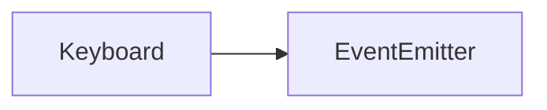

# Keyboard API 文档

本文档由 `DeepSeek R1` 模型生成并微调。



## 类描述

`Keyboard` 是虚拟键盘的核心类，用于管理动态按键布局、处理按键事件及辅助键状态。继承自 `EventEmitter`，支持自定义事件监听。

---

## 属性说明

| 属性名         | 类型             | 描述                                                        |
| -------------- | ---------------- | ----------------------------------------------------------- |
| `id`           | `string`         | 键盘的唯一标识符                                            |
| `keys`         | `KeyboardItem[]` | 当前键盘包含的按键列表（响应式数组）                        |
| `assist`       | `number`         | 辅助键状态（二进制位表示：Ctrl=1<<0, Shift=1<<1, Alt=1<<2） |
| `fontSize`     | `number`         | 按键文本字体大小（默认 18）                                 |
| `list`（静态） | `Keyboard[]`     | 静态属性，存储所有已创建的键盘实例                          |

**KeyboardItem 结构**：

```typescript
interface KeyboardItem {
    key: KeyCode; // 按键代码
    text?: string; // 显示文本（可选）
    x: number; // X 坐标
    y: number; // Y 坐标
    width: number; // 宽度
    height: number; // 高度
}
```

---

## 构造方法

```typescript
function constructor(id: string): Keyboard;
```

-   **参数**
    -   `id`: 键盘的唯一标识符

**示例**

```typescript
const numpad = new Keyboard('numpad');
```

---

## 方法说明

### `add`

```typescript
function add(item: KeyboardItem): Keyboard;
```

### `remove`

```typescript
function remove(item: KeyboardItem): Keyboard;
```

添加/移除按键，返回当前实例以便链式调用。

**示例**

```typescript
// 添加数字键 1
numpad.add({
    key: KeyCode.Digit1,
    text: '1',
    x: 0,
    y: 0,
    width: 60,
    height: 60
});

// 移除按键
numpad.remove(existingKey);
```

---

### `extend`

```typescript
function extend(
    keyboard: Keyboard,
    offsetX?: number,
    offsetY?: number
): Keyboard;
```

继承其他键盘的按键布局并添加偏移量。

**示例**

```typescript
const extendedKB = new Keyboard('extended');
extendedKB.extend(numpad, 100, 0); // 向右偏移 100px
```

---

### `emitKey`

```typescript
function emitKey(key: KeyboardItem, index: number): void;
```

模拟触发按键事件（自动处理辅助键状态）。

---

### `createScope`

```typescript
function createScope(): symbol;
```

### `disposeScope`

```typescript
function disposeScope(): void;
```

管理事件监听作用域：

-   `createScope`: 创建新作用域（返回唯一标识符）
-   `disposeScope`: 释放当前作用域

---

### `withAssist`

```typescript
function withAssist(assist: number): symbol;
```

创建预设辅助键状态的作用域（如 `Ctrl+Shift`）。

---

### `Keyboard.get`

```typescript
function get(id: string): Keyboard | undefined;
```

**静态方法**：根据 ID 获取键盘实例。

---

## 事件说明

| 事件名         | 参数类型                  | 触发时机           |
| -------------- | ------------------------- | ------------------ |
| `add`          | `KeyboardItem`            | 新增按键时         |
| `remove`       | `KeyboardItem`            | 移除按键时         |
| `extend`       | `Keyboard`                | 继承其他键盘布局时 |
| `emit`         | `item, assist, index, ev` | 触发按键时         |
| `scopeCreate`  | `symbol`                  | 创建作用域时       |
| `scopeDispose` | `symbol`                  | 释放作用域时       |

**事件监听示例**

```typescript
numpad.on('emit', (item, assist) => {
    console.log(`按键 ${item.key} 触发，辅助键状态：${assist}`);
});
```

---

## 总使用示例

```typescript
import { KeyCode } from '@motajs/client-base';
import { Keyboard } from '@motajs/system-action';

// 创建数字键盘
const numpad = new Keyboard('numpad');

// 添加基础按键
numpad
    .add({ key: KeyCode.Digit1, x: 0, y: 0, width: 60, height: 60 })
    .add({ key: KeyCode.Digit2, x: 60, y: 0, width: 60, height: 60 });

// 添加功能键（带辅助状态）
const ctrlScope = numpad.withAssist(1 << 0); // Ctrl 激活
numpad.add({
    key: KeyCode.KeyC,
    text: '复制',
    x: 120,
    y: 0,
    width: 120,
    height: 60
});

// 监听复制键
numpad.on('emit', item => {
    if (item.key === KeyCode.KeyC) {
        console.log('执行复制操作');
    }
});

// 触发按键
numpad.emitKey(numpad.keys[0], 0); // 模拟按下数字 1

// 获取键盘实例
const foundKB = Keyboard.get('numpad');
```
