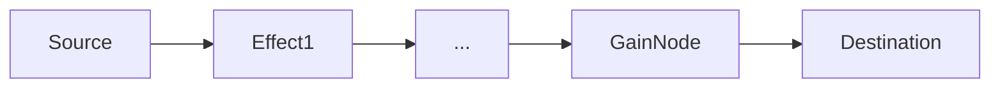
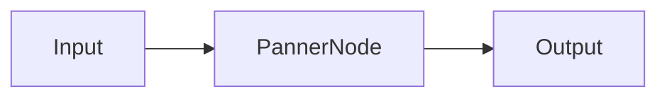
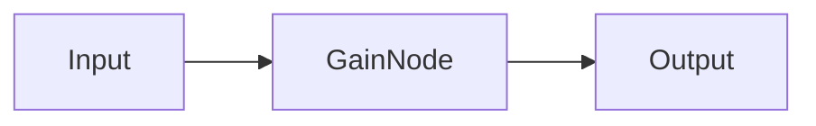
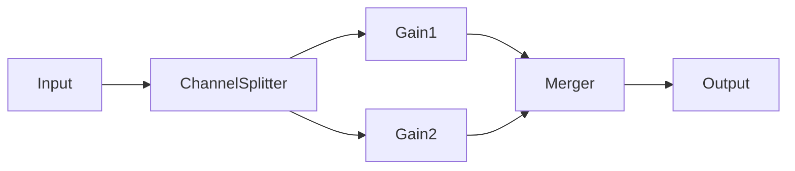
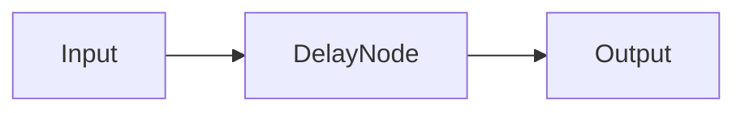
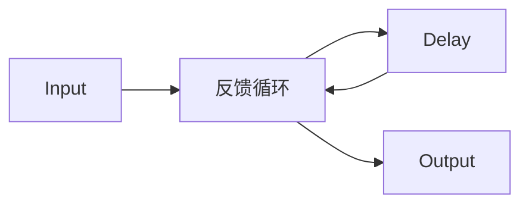

# AudioEffect API 文档

本文档由 `DeepSeek R1` 模型生成并微调。

---

## 类描述

音频处理管道的核心抽象类，为构建音频效果链提供基础框架。所有效果器通过输入/输出节点串联，形成可定制的音频处理流水线。

---

## 核心架构

音频播放流程：



---

## 抽象成员说明

| 成员     | 类型        | 说明                       |
| -------- | ----------- | -------------------------- |
| `input`  | `AudioNode` | 效果器输入节点（必须实现） |
| `output` | `AudioNode` | 效果器输出节点（必须实现） |

---

## 核心方法说明

### `connect`

```typescript
function connect(target: IAudioInput, output?: number, input?: number): void;
```

连接至下游音频节点

| 参数   | 类型          | 说明                       |
| ------ | ------------- | -------------------------- |
| target | `IAudioInput` | 目标效果器/节点            |
| output | `number`      | 当前效果器输出通道（可选） |
| input  | `number`      | 目标效果器输入通道（可选） |

---

### `disconnect`

```typescript
function disconnect(
    target?: IAudioInput,
    output?: number,
    input?: number
): void;
```

断开与下游节点的连接

---

### `abstract start`

```typescript
function start(): void;
```

效果器激活时调用（可用于初始化参数）

---

### `abstract end`

```typescript
function end(): void;
```

效果器停用时调用（可用于资源回收）

---

## 自定义效果器示例

### 混响效果器实现

```typescript
export class ReverbEffect extends AudioEffect {
    private convolver: ConvolverNode;
    private dryGain: GainNode;
    private wetGain: GainNode;

    constructor(ac: AudioContext) {
        super(ac);

        // 创建节点网络
        this.dryGain = ac.createGain();
        this.wetGain = ac.createGain();
        this.convolver = ac.createConvolver();

        // 定义输入输出
        this.input = this.dryGain;
        this.output = this.ac.createGain();

        // 构建处理链
        this.dryGain.connect(this.output);
        this.dryGain.connect(this.convolver);
        this.convolver.connect(this.wetGain);
        this.wetGain.connect(this.output);
    }

    /** 设置混响强度 */
    setMix(value: number) {
        this.dryGain.gain.value = 1 - value;
        this.wetGain.gain.value = value;
    }

    /** 加载脉冲响应 */
    async loadImpulse(url: string) {
        const response = await fetch(url);
        const buffer = await this.ac.decodeAudioData(
            await response.arrayBuffer()
        );
        this.convolver.buffer = buffer;
    }

    start() {
        this.output.gain.value = 1;
    }

    end() {
        this.output.gain.value = 0;
    }
}
```

---

## 内置效果器说明

### StereoEffect（立体声控制）



-   控制声相/3D 空间定位
-   支持设置声音方位和位置

### VolumeEffect（音量控制）



-   全局音量调节
-   支持实时音量渐变

### ChannelVolumeEffect（多声道控制）



-   6 声道独立音量控制
-   支持环绕声场调节

### DelayEffect（延迟效果）



-   基础延迟效果
-   精确到采样级的延迟控制

### EchoEffect（回声效果）



-   带反馈的延迟效果
-   自动渐弱回声处理

---
