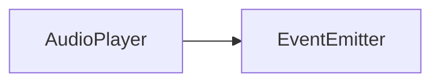
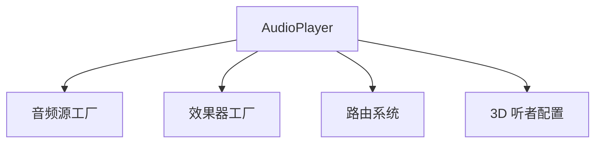
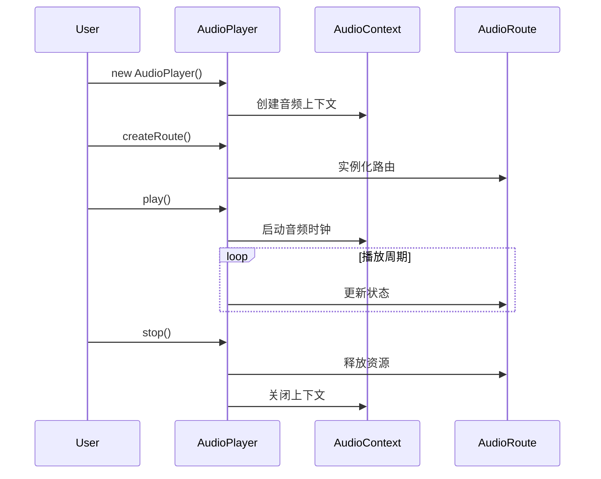

# AudioPlayer API 文档

本文档由 `DeepSeek R1` 模型生成并微调。

---

## 类描述

音频系统的核心控制器，负责管理音频上下文、路由系统、效果器工厂和全局音频参数。支持多音轨管理和 3D 音频空间化配置。



---

## 核心架构



---

## 属性说明

| 属性名        | 类型                      | 说明                     |
| ------------- | ------------------------- | ------------------------ |
| `ac`          | `AudioContext`            | Web Audio API 上下文实例 |
| `audioRoutes` | `Map<string, AudioRoute>` | 已注册的音频路由表       |
| `gain`        | `GainNode`                | 全局音量控制节点         |

---

## 方法说明

此处暂时只列出方法的简易说明。方法理解难度不高，如果需要可以自行查看代码以及其相关注释来查看如何使用。

### 音频源工厂方法

| 方法名                  | 返回值               | 说明                          |
| ----------------------- | -------------------- | ----------------------------- |
| `createSource(Source)`  | `AudioSource`        | 创建自定义音频源              |
| `createStreamSource()`  | `AudioStreamSource`  | 创建流式音频源（直播/长音频） |
| `createElementSource()` | `AudioElementSource` | 基于 HTML5 Audio 元素的音源   |
| `createBufferSource()`  | `AudioBufferSource`  | 基于 AudioBuffer 的静态音源   |

### 效果器工厂方法

| 方法名                        | 返回值                | 说明                         |
| ----------------------------- | --------------------- | ---------------------------- |
| `createEffect(Effect)`        | `AudioEffect`         | 创建自定义效果器             |
| `createVolumeEffect()`        | `VolumeEffect`        | 全局音量控制器               |
| `createStereoEffect()`        | `StereoEffect`        | 立体声场控制器               |
| `createChannelVolumeEffect()` | `ChannelVolumeEffect` | 多声道独立音量控制（6 声道） |
| `createDelayEffect()`         | `DelayEffect`         | 精确延迟效果器               |
| `createEchoEffect()`          | `EchoEffect`          | 回声效果器（带反馈循环）     |

### 路由管理方法

| 方法名                | 参数                 | 说明           |
| --------------------- | -------------------- | -------------- |
| `createRoute(source)` | `AudioSource`        | 创建新播放路由 |
| `addRoute(id, route)` | `string, AudioRoute` | 注册命名路由   |
| `getRoute(id)`        | `string`             | 获取已注册路由 |
| `removeRoute(id)`     | `string`             | 移除指定路由   |

### 全局控制方法

| 方法名                          | 参数                     | 说明                 |
| ------------------------------- | ------------------------ | -------------------- |
| `setVolume(volume)`             | `number` (0.0-1.0)       | 设置全局音量         |
| `getVolume()`                   | -                        | 获取当前全局音量     |
| `setListenerPosition(x,y,z)`    | `number, number, number` | 设置听者 3D 空间坐标 |
| `setListenerOrientation(x,y,z)` | `number, number, number` | 设置听者朝向         |
| `setListenerUp(x,y,z)`          | `number, number, number` | 设置听者头顶朝向     |

---

## 使用示例

### 基础音乐播放

```typescript
import { audioPlayer } from '@user/client-modules';

// 创建音频源（以音频缓冲为例）
const bgmSource = audioPlayer.createBufferSource();

// 创建播放路由
const bgmRoute = audioPlayer.createRoute(bgmSource);

// 添加效果链
bgmRoute.addEffect([
    audioPlayer.createStereoEffect(),
    audioPlayer.createVolumeEffect()
]);

// 播放控制
audioPlayer.play('bgm');
audioPlayer.pause('bgm');
```

### 3D 环境音效

```typescript
import { audioPlayer } from '@user/client-modules';

// 配置3D听者
audioPlayer.setListenerPosition(0, 0, 0); // 听者在原点
audioPlayer.setListenerOrientation(0, 0, -1); // 面朝屏幕内

// 创建环境音源
const ambientSource = audioPlayer.createBufferSource();
await ambientSource.setBuffer(/* 这里填写音频缓冲 */);

// 配置3D音效路由
const ambientRoute = audioPlayer.createRoute(ambientSource);
const stereo = audioPlayer.createStereoEffect();
stereo.setPosition(5, 2, -3); // 音源位于右前方高处
ambientRoute.addEffect(stereo);

// 循环播放
ambientRoute.setLoop(true);
audioPlayer.addRoute('ambient', ambientRoute);
audioPlayer.play('ambient');
```

---

## 生命周期管理



---

## 注意事项

1. **空间音频配置**  
   3D 效果需统一坐标系：

    ```txt
    (0,0,0) 屏幕中心
    X+ → 右
    Y+ ↑ 上
    Z+ ⊙ 朝向用户
    ```
