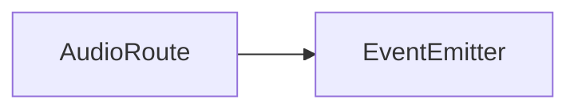
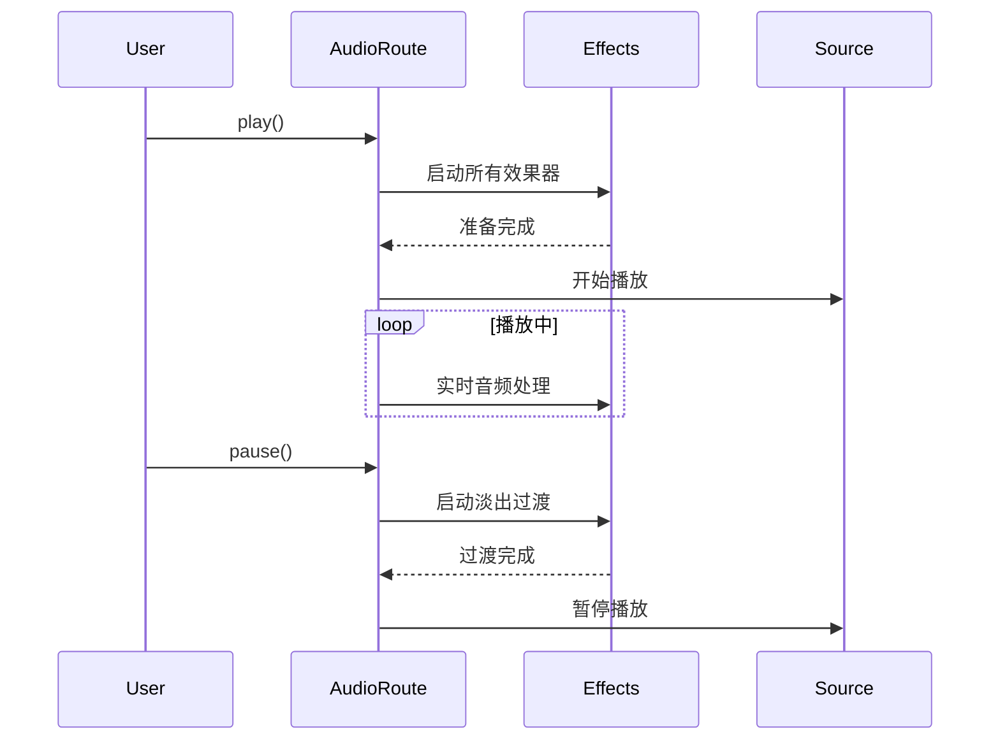

# AudioRoute 音频播放路由 API 文档

本文档由 `DeepSeek R1` 模型生成并微调。

---

## 类描述

音频播放控制的核心类，负责管理音频源与效果器的连接关系，协调播放状态转换，并处理音频管线生命周期。



---

## 属性说明

| 属性名        | 类型               | 说明                                             |
| ------------- | ------------------ | ------------------------------------------------ |
| `output`      | `AudioNode`        | 最终输出节点（继承自 IAudioOutput）              |
| `effectRoute` | `AudioEffect[]`    | 效果器链数组（按顺序存储已连接的效果器实例）     |
| `endTime`     | `number`           | 淡出过渡时长（单位：秒），默认 0                 |
| `status`      | `AudioStatus`      | 当前播放状态（见下方枚举定义）                   |
| `duration`    | `number` (getter)  | 音频总时长（单位：秒）                           |
| `currentTime` | `number` (get/set) | 当前播放进度（单位：秒），设置时会触发 seek 操作 |

---

### AudioStatus 枚举

```typescript
enum AudioStatus {
    Playing, // 正在播放
    Pausing, // 淡出暂停过程中
    Paused, // 已暂停
    Stoping, // 淡出停止过程中
    Stoped // 已停止
}
```

---

## 方法说明

### `setEndTime`

```typescript
function setEndTime(time: number): void;
```

设置淡出过渡时长

| 参数 | 类型     | 说明                     |
| ---- | -------- | ------------------------ |
| time | `number` | 淡出动画时长（单位：秒） |

---

### `onStart`

```typescript
function onStart(fn?: (route: AudioRoute) => void): void;
```

注册播放开始钩子函数

| 参数 | 类型              | 说明                     |
| ---- | ----------------- | ------------------------ |
| `fn` | `(route) => void` | 播放开始时触发的回调函数 |

---

### `onEnd`

```typescript
function onEnd(fn?: (time: number, route: AudioRoute) => void): void;
```

注册播放结束钩子函数

| 参数 | 类型                        | 说明                                          |
| ---- | --------------------------- | --------------------------------------------- |
| `fn` | `(duration, route) => void` | 淡出阶段开始时触发的回调，duration 为淡出时长 |

---

### `play`

```typescript
function play(when?: number = 0): Promise<void>;
```

启动/恢复音频播放

| 参数   | 类型     | 说明                                   |
| ------ | -------- | -------------------------------------- |
| `when` | `number` | 基于 AudioContext 时间的启动时刻（秒） |

---

### `pause`

```typescript
function pause(): Promise<void>;
```

触发暂停流程（执行淡出过渡）

---

### `resume`

```typescript
function resume(): void;
```

从暂停状态恢复播放（执行淡入过渡）

---

### `stop`

```typescript
function stop(): Promise<void>;
```

完全停止播放并释放资源

---

### `addEffect`

```typescript
function addEffect(effect: AudioEffect | AudioEffect[], index?: number): void;
```

添加效果器到处理链

| 参数     | 类型               | 说明                           |
| -------- | ------------------ | ------------------------------ |
| `effect` | `AudioEffect`/数组 | 要添加的效果器实例             |
| `index`  | `number` (可选)    | 插入位置，负数表示从末尾倒计数 |

---

### `removeEffect`

```typescript
function removeEffect(effect: AudioEffect): void;
```

从处理链移除效果器

| 参数     | 类型          | 说明               |
| -------- | ------------- | ------------------ |
| `effect` | `AudioEffect` | 要移除的效果器实例 |

---

## 事件说明

| 事件名         | 参数 | 触发时机           |
| -------------- | ---- | ------------------ |
| `updateEffect` | -    | 效果器链发生变更时 |
| `play`         | -    | 开始/恢复播放时    |
| `stop`         | -    | 完全停止播放后     |
| `pause`        | -    | 进入暂停状态后     |
| `resume`       | -    | 从暂停状态恢复时   |

---

## 总使用示例

```typescript
import { audioPlayer } from '@user/client-modules';

// 创建音频播放器和路由
const source = audioPlayer.createBufferSource();
const route = audioPlayer.createRoute(audioSource);

// 配置效果链
const stereo = audioPlayer.createStereoEffect();
const echo = audioPlayer.createEchoEffect();
const volume = audioPlayer.createVolumeEffect();

route.addEffect([stereo, echo], 0); // 插入到链首
route.addEffect(volume); // 音量控制放到链尾

// 播放暂停
await route.play();
await route.pause();
route.resume(); // 继续操作不是异步，不需要 await
await route.stop();
```

---

## 处理流程示意图


