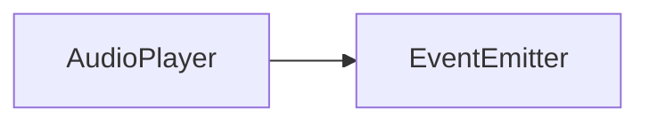
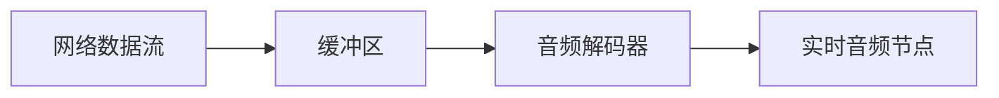
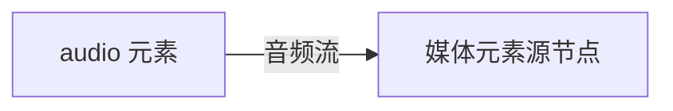
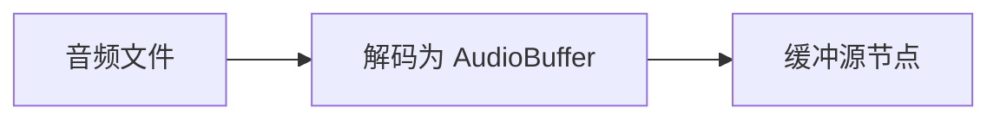

# AudioSource API 文档

本文档由 `DeepSeek R1` 模型生成并微调。

---

## 类描述

音频系统的源头抽象类，定义了音频播放的核心控制接口。支持多种音频源类型，包括流媒体、HTML 音频元素和静态音频缓冲。



---

## 抽象成员说明

| 成员          | 类型        | 说明                     |
| ------------- | ----------- | ------------------------ |
| `output`      | `AudioNode` | 音频输出节点（必须实现） |
| `duration`    | `number`    | 音频总时长（秒）         |
| `currentTime` | `number`    | 当前播放时间（秒）       |
| `playing`     | `boolean`   | 播放状态标识             |

---

## 核心方法说明

### `abstract play`

```typescript
function play(when?: number): void;
```

启动音频播放时序

| 参数 | 类型     | 说明                                            |
| ---- | -------- | ----------------------------------------------- |
| when | `number` | 预定播放时间（基于 `AudioContext.currentTime`） |

---

### `abstract stop`

```typescript
function stop(): number;
```

停止播放并返回停止时刻

---

### `abstract connect`

```typescript
function connect(target: IAudioInput): void;
```

连接至音频处理管线

| 参数   | 类型          | 说明                |
| ------ | ------------- | ------------------- |
| target | `IAudioInput` | 下游处理节点/效果器 |

---

### `abstract setLoop`

```typescript
function setLoop(loop: boolean): void;
```

设置循环播放模式

---

## 事件系统

| 事件名 | 参数 | 触发时机       |
| ------ | ---- | -------------- |
| `play` | -    | 开始播放时     |
| `end`  | -    | 自然播放结束时 |

---

## 自定义音频源示例

### 网络实时通话源

```typescript
class WebRTCAudioSource extends AudioSource {
    private mediaStream: MediaStreamAudioSourceNode;
    output: AudioNode;

    constructor(ac: AudioContext, stream: MediaStream) {
        super(ac);
        this.mediaStream = ac.createMediaStreamSource(stream);
        this.output = this.mediaStream;
    }

    get duration() {
        return Infinity;
    } // 实时流无固定时长
    get currentTime() {
        return this.ac.currentTime;
    }

    play() {
        this.mediaStream.connect(this.output);
        this.playing = true;
        this.emit('play');
    }

    stop() {
        this.mediaStream.disconnect();
        this.playing = false;
        return this.ac.currentTime;
    }

    connect(target: IAudioInput) {
        this.output.connect(target.input);
    }

    setLoop() {} // 实时流不支持循环
}

// 使用示例
navigator.mediaDevices.getUserMedia({ audio: true }).then(stream => {
    const source = new WebRTCAudioSource(audioContext, stream);
    source.connect(effectsChain);
    source.play();
});
```

---

## 内置实现说明

### AudioStreamSource（流媒体源）



-   支持渐进式加载
-   动态缓冲管理
-   适用于浏览器自身不支持的音频类型

### AudioElementSource（HTML 音频元素源）



-   基于 HTML5 Audio 元素
-   支持跨域资源
-   自动处理音频格式兼容

### AudioBufferSource（静态音频缓冲源）



-   完整音频数据预加载
-   精确播放控制
-   支持内存音频播放

---

## 注意事项

1. **时间精度**  
   所有时间参数均以 `AudioContext.currentTime` 为基准，精度可达 0.01 秒
