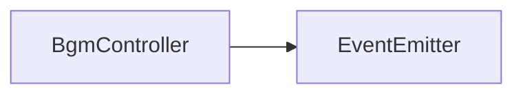

# BgmController API 文档

本文档由 `DeepSeek R1` 模型生成并微调。



## 类描述

`BgmController` 是背景音乐系统的核心控制器，支持多 BGM 的加载、音量控制、渐变切换和播放状态管理。继承自 `EventEmitter`，提供完整的音频事件监听机制。

---

## 泛型说明

-   `T extends string`: BGM 的唯一标识符类型（默认为项目预定义的 `BgmIds`）

---

## 属性说明

| 属性名           | 类型      | 描述                                      |
| ---------------- | --------- | ----------------------------------------- |
| `prefix`         | `string`  | BGM 资源路径前缀（默认 `bgms.`）          |
| `playingBgm`     | `T`       | 当前正在播放的 BGM ID                     |
| `enabled`        | `boolean` | 是否启用音频控制（默认 true）             |
| `transitionTime` | `number`  | 音频切换渐变时长（单位：毫秒，默认 2000） |

---

## 核心方法说明

### `setTransitionTime`

```typescript
function setTransitionTime(time: number): void;
```

设置所有 BGM 的渐变切换时长。

-   **参数**
    -   `time`: 渐变时长（毫秒）

---

### `blockChange`

```typescript
function blockChange(): void;
```

### `unblockChange`

```typescript
function unblockChange(): void;
```

屏蔽/解除屏蔽 BGM 切换（用于特殊场景）。

---

### `setVolume`

```typescript
function setVolume(volume: number): void;
```

### `getVolume`

```typescript
function getVolume(): number;
```

控制全局音量（范围 0-1）。

---

### `setEnabled`

```typescript
function setEnabled(enabled: boolean): void;
```

启用/禁用整个 BGM 系统（禁用时停止所有播放）。

---

### `addBgm`

```typescript
function addBgm(id: T, url?: string): void;
```

加载并注册 BGM 资源。

-   **参数**
    -   `id`: BGM 唯一标识
    -   `url`: 自定义资源路径（默认 `project/bgms/${id}`）

---

### `removeBgm`

```typescript
function removeBgm(id: T): void;
```

移除已注册的 BGM 资源。

---

### 播放控制方法

```typescript
function play(id: T, when?: number): void; // 播放指定 BGM（带渐变）
function pause(): void; // 暂停当前 BGM（保留进度）
function resume(): void; // 继续播放当前 BGM
function stop(): void; // 停止当前 BGM（重置进度）
```

---

## 事件说明

| 事件名   | 参数 | 触发时机          |
| -------- | ---- | ----------------- |
| `play`   | `[]` | 开始播放新 BGM 时 |
| `pause`  | `[]` | 暂停播放时        |
| `resume` | `[]` | 继续播放时        |
| `stop`   | `[]` | 完全停止播放时    |

---

## 总使用示例

```typescript
import { bgmController } from '@user/client-modules';

// 设置全局参数
bgmCtrl.setTransitionTime(1500);
bgmCtrl.setVolume(0.8);

// 播放控制
bgmCtrl.play('battle.mp3'); // 播放战斗BGM
bgmCtrl.pause(); // 暂停（如打开菜单）
bgmCtrl.resume(); // 继续播放
bgmCtrl.play('boss_battle.mp3'); // 切换至BOSS战BGM
bgmCtrl.stop(); // 完全停止（如战斗结束）

// 事件监听
bgmCtrl.on('play', () => {
    console.log('BGM 开始播放:', bgmCtrl.playingBgm);
});
```
