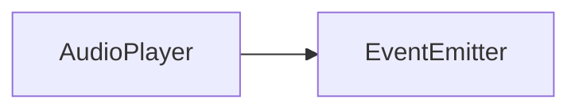
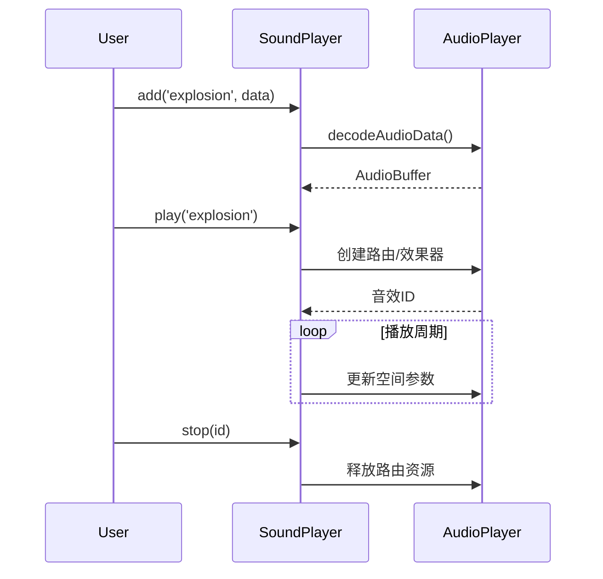

# SoundPlayer API 文档

本文档由 `DeepSeek R1` 模型生成并微调。

---

## 类描述

音效管理核心类，提供短音频的加载、播放和空间化控制功能。推荐通过全局单例 `soundPlayer` 使用。



---

## 属性说明

| 属性名    | 类型                  | 说明                   |
| --------- | --------------------- | ---------------------- |
| `enabled` | `boolean`             | 总开关状态（默认启用） |
| `buffer`  | `Map<T, AudioBuffer>` | 已加载音效缓冲存储池   |
| `playing` | `Set<number>`         | 当前活跃音效 ID 集合   |
| `gain`    | `VolumeEffect`        | 全局音量控制器         |

---

## 方法说明

### 基础控制

#### setEnabled

```typescript
function setEnabled(enabled: boolean): void;
```

启用/禁用音效系统（禁用时立即停止所有音效）

| 参数    | 类型      | 说明         |
| ------- | --------- | ------------ |
| enabled | `boolean` | 是否启用音效 |

---

#### setVolume / getVolume

```typescript
function setVolume(volume: number): void;
function getVolume(): number;
```

全局音量控制（范围 0.0~1.0）

---

### 资源管理

#### add

```typescript
async function add(id: T, data: Uint8Array): Promise<void>;
```

加载并缓存音效资源

| 参数 | 类型         | 说明             |
| ---- | ------------ | ---------------- |
| id   | `T`          | 音效唯一标识符   |
| data | `Uint8Array` | 原始音频字节数据 |

---

### 播放控制

#### play

```typescript
function play(
    id: T,
    position?: [number, number, number],
    orientation?: [number, number, number]
): number;
```

播放指定音效（返回音效实例 ID）

| 参数        | 类型        | 默认值    | 说明                      |
| ----------- | ----------- | --------- | ------------------------- |
| id          | `T`         | -         | 音效标识符                |
| position    | `[x, y, z]` | `[0,0,0]` | 3D 空间坐标（右手坐标系） |
| orientation | `[x, y, z]` | `[1,0,0]` | 声音传播方向向量          |

**坐标系说明**：

```txt
(0,0,0) 听者位置
X+ → 右
Y+ ↑ 上
Z+ ⊙ 朝向听者正前方
```

---

#### stop

```typescript
function stop(num: number): void;
```

停止指定音效实例

| 参数 | 类型     | 说明                 |
| ---- | -------- | -------------------- |
| num  | `number` | play() 返回的实例 ID |

---

#### stopAllSounds

```typescript
function stopAllSounds(): void;
```

立即停止所有正在播放的音效

---

## 使用示例

### 基础音效系统

```typescript
import { soundPlayer } from '@user/client-modules';

// 播放射击音效（右侧声场）
const shotId = soundPlayer.play('shoot', [2, 0, 0]);

// 播放爆炸音效（左后方）
soundPlayer.play('explosion', [-3, 0, -2], [-1, 0, -1]);

// 停止特定音效
soundPlayer.stop(shotId);

// 全局音量控制
soundPlayer.setVolume(0.7);
```

### 3D 环境音效

```typescript
// 汽车引擎循环音效
let engineSoundId = -1;

function startEngine() {
    engineSoundId = soundPlayer.play('engine', [0, 0, -5]);
}

function updateCarPosition(x: number, z: number) {
    const route = audioPlayer.getRoute(`sounds.${engineSoundId}`);
    const stereo = route?.effectRoute[0] as StereoEffect;
    stereo?.setPosition(x, 0, z);
}
```

---

## 生命周期管理



---

## 注意事项

1. **实例数量限制**  
   同时播放音效建议不超过 32 个，可通过优先级系统管理
