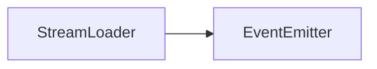

# StreamLoader API 文档

本文档由 `DeepSeek R1` 模型生成并微调。



## 类描述

`StreamLoader` 是流式加载大文件的核心类，支持分块读取网络资源并通过事件机制传递数据。继承自 `EventEmitter`，实现 `IStreamController` 接口，提供流传输控制能力。

---

## 属性说明

| 属性名    | 类型      | 描述                   |
| --------- | --------- | ---------------------- |
| `url`     | `string`  | 只读，要加载的资源 URL |
| `loading` | `boolean` | 当前是否处于加载状态   |

---

## 构造方法

```typescript
function constructor(url: string): StreamLoader;
```

-   **参数**
    -   `url`: 要加载的资源地址

**示例**

```typescript
const loader = new StreamLoader('/api/large-file');
```

---

## 方法说明

### `pipe`

```typescript
function pipe(reader: IStreamReader): this;
```

将流数据管道传递给读取器对象。

-   **参数**
    -   `reader`: 实现 `IStreamReader` 接口的对象

**示例**

```typescript
class MyReader implements IStreamReader {
    async pump(data, done) {
        console.log('收到数据块:', data);
    }
    // ... 还有一些其他需要实现的方法，参考总是用示例
}
loader.pipe(new MyReader());
```

---

### `start`

```typescript
function start(): Promise<void>;
```

启动流传输流程（自动处理分块读取与分发）。

---

### `cancel`

```typescript
function cancel(reason?: string): void;
```

终止当前流传输。

-   **参数**
    -   `reason`: 终止原因描述（可选）

**示例**

```typescript
// 用户取消加载
loader.cancel('用户手动取消');
```

---

## 事件说明

| 事件名 | 参数类型                          | 触发时机                 |
| ------ | --------------------------------- | ------------------------ |
| `data` | `data: Uint8Array, done: boolean` | 每接收到一个数据块时触发 |

**事件监听示例**

```typescript
loader.on('data', (data, done) => {
    if (done) console.log('传输完成');
});
```

---

## 相关接口说明

### IStreamReader

```typescript
export interface IStreamReader<T = any> {
    /**
     * 接受字节流流传输的数据
     * @param data 传入的字节流数据，只包含本分块的内容
     * @param done 是否传输完成
     */
    pump(
        data: Uint8Array | undefined,
        done: boolean,
        response: Response
    ): Promise<void>;

    /**
     * 当前对象被传递给加载流时执行的函数
     * @param controller 传输流控制对象
     */
    piped(controller: IStreamController<T>): void;

    /**
     * 开始流传输
     * @param stream 传输流对象
     * @param controller 传输流控制对象
     */
    start(
        stream: ReadableStream,
        controller: IStreamController<T>,
        response: Response
    ): Promise<void>;

    /**
     * 结束流传输
     * @param done 是否传输完成，如果为 false 的话，说明可能是由于出现错误导致的终止
     * @param reason 如果没有传输完成，那么表示失败的原因
     */
    end(done: boolean, reason?: string): void;
}
```

-   `pump`: 处理每个数据块
-   `piped`: 当读取器被绑定到流时调用
-   `start`: 流传输开始时调用
-   `end`: 流传输结束时调用

---

## 总使用示例

```typescript
// 创建流加载器
const loader = new StreamLoader('/api/video-stream');

const videoElement = document.createElement('video');

// 实现自定义读取器
class VideoStreamReader implements IStreamReader {
    async pump(data, done) {
        if (data) videoElement.appendBuffer(data);
        if (done) videoElement.play();
    }

    piped(controller) {
        console.log('流传输管道连接成功');
    }

    start() {
        console.log('开始流式加载');
    }

    end() {
        console.log('流式加载结束');
    }
}

const reader = new VideoStreamReader();

// 绑定读取器并启动
loader.pipe(reader);
loader.start();

// 监听进度
loader.on('data', (_, done) => {
    if (!done) updateProgressBar();
});

// 错误处理
videoElement.onerror = () => loader.cancel('视频解码错误');
```
