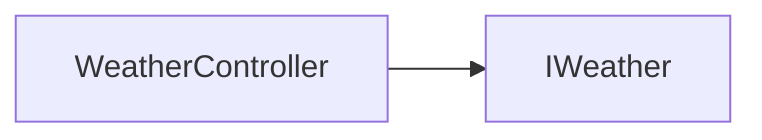

# WeatherController API 文档

本文档由 `DeepSeek R1` 模型生成并微调。



_实现 `IWeather` 接口_

## 类描述

`WeatherController` 是天气系统的核心控制器，支持动态管理多种天气效果（如雨、雪、雾等），可将天气效果绑定到任意渲染元素上，实现多场景独立天气控制。

---

## 属性说明

| 属性名         | 类型                             | 描述                                                              |
| -------------- | -------------------------------- | ----------------------------------------------------------------- |
| `id`           | `string`                         | 只读，控制器的唯一标识符                                          |
| `active`       | `Set<IWeather>`                  | 当前激活的天气实例集合                                            |
| `list`（静态） | `Map<string, Weather>`           | 静态属性，存储所有注册的天气类型（键为天气 ID，值为天气构造函数） |
| `map`（静态）  | `Map<string, WeatherController>` | 静态属性，存储所有控制器实例                                      |

---

## 构造方法

```typescript
function constructor(id: string): WeatherController;
```

-   **参数**
    -   `id`: 控制器的标识符

## 方法说明

### `activate`

```typescript
function activate(id: string, level?: number): IWeather | undefined;
```

激活指定天气。

-   **参数**
    -   `id`: 已注册的天气 ID
    -   `level`: 天气强度等级（可选）

---

### `bind`

```typescript
function bind(item?: RenderItem): void;
```

绑定/解绑渲染元素。

-   **参数**
    -   `item`: 要绑定的渲染元素（不传则解绑）

---

### `deactivate`

```typescript
function deactivate(weather: IWeather): void;
```

关闭指定天气效果。

---

### `clearWeather`

```typescript
function clearWeather(): void;
```

清空所有天气效果。

---

### `getWeather`

```typescript
function getWeather<T extends IWeather = IWeather>(
    weather: new (level?: number) => T
): T | null;
```

获取指定天气实例。

**示例**

```ts
import { RainWeather } from '@user/client-modules';

const rain = controller.getWeather(RainWeather);
```

---

### `destroy`

```typescript
function destroy(): void;
```

摧毁这个天气控制器，摧毁后不可继续使用。

---

## 静态方法说明

### `WeatherController.register`

```typescript
function register(id: string, weather: Weather): void;
```

**静态方法**：注册新的天气类型。

-   **参数**
    -   `id`: 天气唯一标识（如 "rain"）
    -   `weather`: 天气类（需实现 `IWeather` 接口）

---

### `WeatherController.get`

```typescript
function get(id: string): WeatherController | undefined;
```

-   **参数**
    -   `id`: 要获得的控制器标识符

## 天气接口说明

```typescript
interface IWeather {
    activate(item: RenderItem): void; // 初始化天气效果
    frame(): void; // 每帧更新逻辑
    deactivate(item: RenderItem): void; // 清除天气效果
}
```

---

## 内置天气

-   `rain`: 下雨天气

## 总使用示例 实现滤镜天气效果

::: code-group

```typescript [定义天气]
// 定义灰度滤镜天气
class GrayFilterWeather implements IWeather {
    private scale: number;
    private now: number = 0;
    private item?: RenderItem;

    constructor(level: number = 5) {
        this.scale = level / 10;
    }

    activate(item: RenderItem) {
        // 添加灰度滤镜
        item.filter = `grayscale(0)`;
        this.item = item;
    }

    frame() {
        // 动态调整滤镜强度（示例：正弦波动）
        if (this.item) {
            const intensity = ((Math.sin(Date.now() / 1000) + 1) * scale) / 2;
            this.item.filter = `grayscale(${itensity})`;
        }
    }

    deactivate(item: RenderItem) {
        item.filter = `none`;
    }
}

// 注册天气类型
WeatherController.register('gray-filter', GrayFilterWeather);
```

```tsx [使用天气]
import { defineComponent, onMounted } from 'vue';
import { Container } from '@motajs/render';
import { useWeather } from '@user/client-modules';

const MyCom = defineComponent(() => {
    const [controller] = useWeather();

    const root = ref<Container>();

    onMounted(() => {
        // 绑定天气的渲染元素
        controller.bind(root.value);
        // 激活天气效果
        controller.activate('gray-filter', 5);
    });

    return () => <container ref={root}></container>;
});
```

:::
