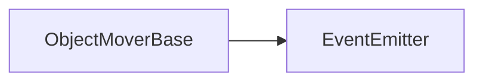
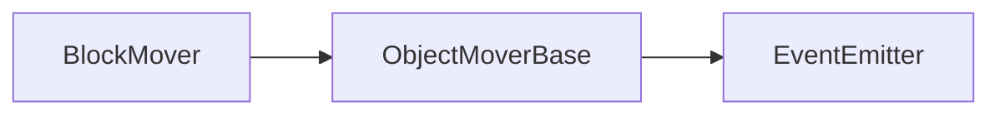

# ObjectMoverBase API 文档

本文档由 `DeepSeek R1` 模型生成并微调。

---

## 类描述

游戏中可移动对象的基类控制器，提供面向方向、移动队列管理和动画协调的通用移动能力。继承自 EventEmitter3，用于实现图块、角色等元素的移动控制。



---

## 核心属性

| 属性名       | 类型              | 说明                     |
| ------------ | ----------------- | ------------------------ |
| `moveSpeed`  | `number`          | 当前移动速度（毫秒/格）  |
| `moveDir`    | `Dir2`            | 当前移动方向（八方向）   |
| `moving`     | `boolean`         | 是否处于移动状态         |
| `faceDir`    | `Dir2`            | 当前面朝方向（八方向）   |
| `controller` | `IMoveController` | 当前移动控制实例（只读） |

---

## 事件说明

| 事件名      | 参数          | 触发时机           |
| ----------- | ------------- | ------------------ |
| `stepEnd`   | `MoveStepDir` | 单步移动完成时     |
| `moveEnd`   | -             | 整个移动队列完成时 |
| `moveStart` | `MoveStep[]`  | 移动队列开始执行时 |

---

## 方法说明

### `startMove`

```typescript
function startMove(): IMoveController | null;
```

**功能**  
启动移动队列执行

**返回值**  
`IMoveController`：移动控制器实例（可追加指令）  
`null`：队列为空或已在移动中时返回

**示例**

```typescript
const controller = mover.startMove();
if (controller) {
    controller.push({ type: 'dir', value: 'right' });
}
```

---

### `insertMove`

```typescript
function insertMove(...move: MoveStep[]): void;
```

| 参数   | 类型         | 说明         |
| ------ | ------------ | ------------ |
| `move` | `MoveStep[]` | 移动指令序列 |

**功能**  
向队列末尾插入移动指令

**示例**

```typescript
// 添加转向+加速指令
mover.insertMove({ type: 'dir', value: 'left' }, { type: 'speed', value: 200 });
```

---

### `clearMoveQueue`

```typescript
function clearMoveQueue(): void;
```

**功能**  
清空所有待执行移动指令

**注意**  
不影响已开始的移动步骤

---

### `oneStep`

```typescript
function oneStep(step: Move2): void;
```

| 参数   | 类型    | 说明                              |
| ------ | ------- | --------------------------------- |
| `step` | `Move2` | 移动方向（支持八向/前后相对方向） |

**功能**  
添加单步方向移动指令

**示例**

```typescript
// 添加面朝方向移动指令
mover.oneStep('forward');
```

---

### `moveAs`

```typescript
function moveAs(steps: MoveStep[]): void;
```

| 参数    | 类型         | 说明               |
| ------- | ------------ | ------------------ |
| `steps` | `MoveStep[]` | 结构化移动指令序列 |

**功能**  
批量加载复杂移动路径

**示例**

```typescript
mover.moveAs([
    { type: 'dir', value: 'up' }, // 向上移动
    { type: 'speed', value: 150 }, // 修改速度为每 150ms 移动一格
    { type: 'dir', value: 'rightup' } // 右上45度移动
]);
```

---

### `setFaceDir`

```typescript
function setFaceDir(dir: Dir2): void;
```

| 参数  | 类型   | 说明           |
| ----- | ------ | -------------- |
| `dir` | `Dir2` | 八方向面朝方向 |

**限制**  
仅在非移动状态生效

**示例**

```typescript
// 设置角色面朝左上方
mover.setFaceDir('leftup');
```

---

### `setMoveDir`

```typescript
function setMoveDir(dir: Dir2): void;
```

| 参数  | 类型   | 说明         |
| ----- | ------ | ------------ |
| `dir` | `Dir2` | 基础移动方向 |

**注意**  
影响`forward/backward`指令的实际方向

---

## 抽象方法

### `abstract onMoveStart`

```typescript
function onMoveStart(controller: IMoveController): Promise<void>;
```

**触发时机**  
移动队列开始执行时

---

### `abstract onMoveEnd`

```typescript
function onMoveEnd(controller: IMoveController): Promise<void>;
```

**触发时机**  
移动队列完成或被中断时

---

### `abstract onStepStart`

```typescript
function onStepStart(
    step: MoveStepDir,
    controller: IMoveController
): Promise<number>;
```

| 参数         | 类型              | 说明         |
| ------------ | ----------------- | ------------ |
| `step`       | `MoveStepDir`     | 当前移动步骤 |
| `controller` | `IMoveController` | 移动控制器   |

**返回值**  
`Promise<number>`：步骤执行标识码（用于后续传递）

---

### `abstract onStepEnd`

```typescript
function onStepEnd(
    step: MoveStepDir,
    code: number,
    controller: IMoveController
): Promise<void>;
```

| 参数         | 类型              | 说明                       |
| ------------ | ----------------- | -------------------------- |
| `code`       | `number`          | `onStepStart` 返回的标识码 |
| `controller` | `IMoveController` | 移动控制器                 |

---

### `abstract onSetMoveSpeed`

```typescript
function onSetMoveSpeed(speed: number, controller: IMoveController): void;
```

| 参数         | 类型              | 说明           |
| ------------ | ----------------- | -------------- |
| `speed`      | `number`          | 新的移动速度值 |
| `controller` | `IMoveController` | 移动控制器     |

---

## BlockMover

`BlockMover` 是基于 `ObjectMoverBase` 的内置类，用于实现图块移动。



### 新增方法

```typescript
function bind(
    x: number,
    y: number,
    floorId: FloorIds,
    layer: FloorLayer,
    dir: Dir = 'down'
): boolean;
```

| 参数      | 类型         | 说明                 |
| --------- | ------------ | -------------------- |
| `x`       | `number`     | 图块 X 坐标          |
| `y`       | `number`     | 图块 Y 坐标          |
| `floorId` | `FloorIds`   | 所在楼层 ID          |
| `layer`   | `FloorLayer` | 图层类型（bg/fg 等） |
| `dir`     | `Dir`        | 初始方向             |

**返回值**：绑定成功返回 `true`，若目标正在移动则返回 `false`

**示例**

```typescript
if (blockMover.bind(5, 8, 'floor1', 'bg', 'up')) {
    blockMover.insertMove({ type: 'dir', value: 'right' });
}
```

---

## HeroMover

`HeroMover` 是基于 `ObjectMoverBase` 的内置类，用于实现勇士移动。


### 覆盖方法

```ts
function startMove(
    ignoreTerrain: boolean = false,
    noRoute: boolean = false,
    inLockControl: boolean = false,
    autoSave: boolean = false
): IMoveController | null;
```

| 参数            | 说明                                     |
| --------------- | ---------------------------------------- |
| `ignoreTerrain` | 是否忽略地形，即是否穿墙                 |
| `noRoute`       | 是否不计入录像                           |
| `inLockControl` | 是否是在锁定控制中移动的，例如事件中移动 |
| `autoSave`      | 在必要时刻是否自动存档                   |

其余用法与基类相同。

---

## 使用示例

### 勇士移动控制

```typescript
import { heroMoverCollection } from '@user/data-state';

// 获取勇士移动控制器单例
const heroMover = heroMoveCollection.mover;

// 设置面朝方向为右侧
heroMover.setFaceDir('right');

// 添加移动指令：前进三步
heroMover.insertMove(
    { type: 'dir', value: 'forward' },
    { type: 'dir', value: 'forward' },
    { type: 'dir', value: 'forward' }
);

// 启动移动并获取控制器
const controller = heroMover.startMove(
    false, // 不允许穿墙
    true, // 不计入录像
    false, // 不在录像锁定中触发
    false // 不进行自动存档
);

if (controller) {
    // 动态追加移动指令
    controller.push({ type: 'dir', value: 'leftup' });
    // 监听移动完成事件
    controller.onEnd.then(() => {
        console.log('勇士移动完成');
    });
}
```

### 图块移动控制

```typescript
import { BlockMover } from '@user/data-state';

// 创建图块移动器实例
const blockMover = new BlockMover();

// 绑定到(5,8)位置的背景图块
if (blockMover.bind(5, 8, 'floor1', 'bg', 'up')) {
    // 添加螺旋移动路径
    blockMover.moveAs([
        { type: 'dir', value: 'right' },
        { type: 'dir', value: 'down' },
        { type: 'dir', value: 'left' },
        { type: 'dir', value: 'up' }
    ]);

    // 设置移动速度为200像素/秒
    blockMover.insertMove({ type: 'speed', value: 200 });

    // 启动移动
    const ctrl = blockMover.startMove();
}
```

---

## 移动指令类型

```typescript
type MoveStep =
    | { type: 'dir'; value: Move2 } // 方向指令
    | { type: 'speed'; value: number }; // 速度指令
```

---

## 注意事项

1. **方向优先级**  
   `forward/backward` 基于当前面朝方向计算，修改 faceDir 会影响实际移动方向

2. **速度叠加规则**  
   多个 speed 指令按队列顺序覆盖，最终生效最后一个速度值

3. **移动中断处理**  
   调用 controller.stop() 会立即中断移动并触发 moveEnd 事件
