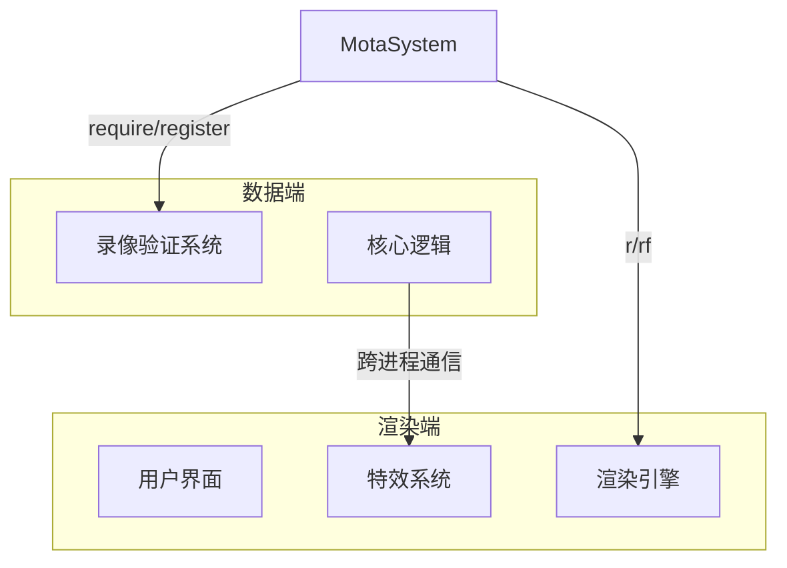

# Mota API 文档

本文档由 `DeepSeek R1` 模型生成并微调。

---

## 核心功能

模块化管理系统，提供跨进程模块注册与获取能力，支持数据端与渲染端分离架构。用于解决服务端录像验证与客户端渲染的模块隔离问题。

---

## 全局访问

```typescript
// 浏览器环境
Mota.require('@motajs/client');

// ESM 环境
import { Mota } from '@motajs/core';
```

---

## 核心方法

### `require`

```typescript
function require<K extends keyof ModuleInterface>(key: K): ModuleInterface[K];
function require<T = unknown>(key: string): T;
```

**功能**  
获取已注册的模块实例

| 参数  | 类型     | 说明                       |
| ----- | -------- | -------------------------- |
| `key` | `string` | 模块标识符或自定义命名空间 |

**返回值**  
对应模块的导出对象

**预定义模块列表**：

```typescript
interface ModuleInterface {
    // ---------- 样板库
    '@motajs/client': typeof Client;
    '@motajs/client-base': typeof ClientBase;
    '@motajs/common': typeof Common;
    '@motajs/legacy-client': typeof LegacyClient;
    '@motajs/legacy-common': typeof LegacyCommon;
    '@motajs/legacy-system': typeof LegacySystem;
    '@motajs/legacy-ui': typeof LegacyUI;
    '@motajs/render': typeof Render;
    '@motajs/render-core': typeof RenderCore;
    '@motajs/render-elements': typeof RenderElements;
    '@motajs/render-style': typeof RenderStyle;
    '@motajs/render-vue': typeof RenderVue;
    '@motajs/system': typeof System;
    '@motajs/system-action': typeof SystemAction;
    '@motajs/system-ui': typeof SystemUI;
    // ---------- 用户扩展
    '@user/client-modules': typeof ClientModules;
    '@user/data-base': typeof DataBase;
    '@user/data-fallback': typeof DataFallback;
    '@user/data-state': typeof DataState;
    '@user/data-utils': typeof DataUtils;
    '@user/legacy-plugin-client': typeof LegacyPluginClient;
    '@user/legacy-plugin-data': typeof LegacyPluginData;
    // ---------- 必要的第三方库
    MutateAnimate: typeof MutateAnimate;
    Vue: typeof Vue;
    Lodash: typeof Lodash;
}
```

**示例**：

```typescript
// 获取动画引擎
const Animate = Mota.require('MutateAnimate');

// 获取Vue实例
const Vue = Mota.require('Vue');

// 获取旧版UI系统
const LegacyUI = Mota.require('@motajs/legacy-ui');
```

---

### `register`

```typescript
function register<K extends keyof ModuleInterface>(
    key: K,
    data: ModuleInterface[K]
): void;
function register(key: string, data: unknown): void;
```

**功能**  
注册模块到全局系统

| 参数   | 类型     | 说明         |
| ------ | -------- | ------------ |
| `key`  | `string` | 模块标识符   |
| `data` | `any`    | 模块导出对象 |

**注意事项**

-   重复注册会触发控制台警告
-   推荐在游戏初始化阶段注册

**示例**：

```typescript
// 注册自定义模块
class MyCustomModule {
    static version = '1.0.0';
}
Mota.register('@user/custom-module', MyCustomModule);

// 使用自定义模块
const custom = Mota.require('@user/custom-module');
console.log(custom.version); // 输出 1.0.0
```

---

## 渲染进程控制

### `r`

```typescript
function r<T = undefined>(fn: (this: T) => void, thisArg?: T): void;
```

**功能**  
包裹只在渲染进程执行的代码

| 参数      | 类型       | 说明                 |
| --------- | ---------- | -------------------- |
| `fn`      | `Function` | 需要渲染端执行的函数 |
| `thisArg` | `any`      | 函数执行上下文       |

**特性**

-   在录像验证和服务端环境下不会执行
-   无返回值设计

**示例**：

```typescript
// 播放仅客户端可见的特效
Mota.r(() => {
    const animate = Mota.require('MutateAnimate');
    animate(heroSprite).shake(5, 1000);
});
```

---

### `rf`

```typescript
function rf<F extends (...params: any) => any, T>(
    fn: F,
    thisArg?: T
): (...params: Parameters<F>) => ReturnType<F> | undefined;
```

**功能**  
生成渲染进程安全函数

| 参数      | 类型       | 说明             |
| --------- | ---------- | ---------------- |
| `fn`      | `Function` | 需要包装的原函数 |
| `thisArg` | `any`      | 函数执行上下文   |

**返回值**  
经过安全包裹的函数，在非渲染环境调用返回 `undefined`

**示例**：

```typescript
// 创建安全渲染函数
const safeAlert = Mota.rf((msg: string) => {
    alert(`客户端提示: ${msg}`);
});

// 调用时自动判断执行环境
safeAlert('仅在客户端显示'); // 服务端返回 undefined
```

---

## 架构示意图



---

## 注意事项

1. **模块隔离**  
   数据端模块与渲染端模块物理隔离，数据端不可直接引用渲染端，而渲染端是可以直接引用数据端的

2. **版本兼容**  
   遗留系统模块（legacy-\*）将在未来版本逐步废弃，这些模块也不再提供 API 文档，如果需要自行阅读源码。

3. **性能优化**  
   高频调用模块建议缓存引用：

    ```typescript
    // 推荐
    const Animate = Mota.require('MutateAnimate');

    // 不推荐
    function update() {
        const Animate = Mota.require('MutateAnimate'); // 每次调用都查找
    }
    ```

4. **错误处理**  
   使用 try-catch 包裹高风险模块获取：
    ```typescript
    try {
        const LegacyUI = Mota.require('@motajs/legacy-ui');
    } catch (e) {
        fallbackUI();
    }
    ```
