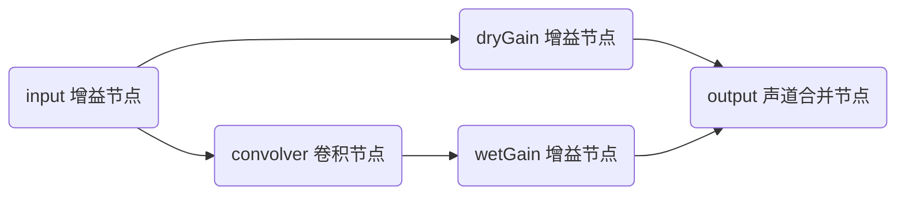

# 音频系统

2.B 有了与 2.A 完全不同的音频系统，新的音频系统更加自由，功能更加丰富，可以创建多种自定义效果器。本文将讲解如何使用音频系统。

:::tip
多数情况下，你应该不需要使用本文所介绍的内容，因为样板已经将音效、背景音乐等处理完善。如果你想实现高级效果，例如混响效果等，才需要阅读本文。
:::

## 获取音频播放器

音频播放器在 `@user/client-modules` 模块中，直接引入即可：

```ts
// 在其他模块中使用模块化语法引入
import { audioPlayer } from '@user/client-modules';
// 在 client-modules 模块中使用模块化语法引入
import { audioPlayer } from '../audio'; // 改为你自己的相对路径

// 使用 Mota 全局变量引入
const { audioPlayer } = Mota.require('@user/client-modules');
```

## 音频系统工作流程

音频播放流程如下：


## 创建音频源

:::tip
本小节的内容极大概率用不到，如果不是需要非常底层的音频接口，可以不看本小节。
:::

样板内置了几种音频源，它们包括：

| 类型            | 适用场景                | 创建方法                |
| --------------- | ----------------------- | ----------------------- |
| `BufferSource`  | 预加载的完整音频文件    | `createBufferSource()`  |
| `ElementSource` | 通过 `<audio>` 标签播放 | `createElementSource()` |
| `StreamSource`  | 流式音频/长音频         | `createStreamSource()`  |

### `StreamSource` 音频源

一般情况下，我们推荐使用 `opus` 格式的音频，这时候需要使用 `StreamSource` 音频源来播放。这个音频源包含了对 IOS 的适配，可以正确播放 `opus` 格式的音频。在使用它之前，我们需要先创建一个 `StreamLoader` 类，来对音频流式加载。假如你在 `project/mybgm/` 文件夹下有一个 `xxx.opus` 音频，你可以这么创建：

```ts
import { StreamLoader } from '@user/client-modules';

const stream = new StreamLoader('project/mybgm/xxx.opus');
```

然后，创建音频源，并将流加载对象泵入音频源：

```ts
const source = audioPlayer.createStreamSource();
stream.pipe(source);
stream.start(); // 开始流式加载，如果不需要实时性，也可以不调用，音频播放时会自动开始加载
```

### `ElementSource` 音频源

从一个 `audio` 元素创建音频源，假设你想要播放 `project/mybgm/xxx.mp3`，那么你可以这么创建：

```ts
const source = audioPlayer.createElementSource();
source.setSource('project/mybgm/xxx.mp3');
```

### `BufferSource` 音频源

从音频缓冲创建音频源。音频缓冲是直接存储在内存中的一段原始音频波形数据，不经过任何压缩。假如你想播放 `project/mysound/xxx.wav`，可以这么写：

```ts
async function loadWav(url: string) {
    // 使用浏览器接口 fetch 来请求文件
    const response = await fetch(url);
    // 将文件接收为 ArrayBuffer 形式
    const buffer = await response.arraybuffer();
    // 创建音频源
    const source = audioPlayer.createBufferSource();
    // 直接传入 ArrayBuffer，内部会自动解析，当然也可以自己解析，传入 AudioBuffer
    await source.setBuffer(source);
    // 将音频源返回，供后续使用
    return source;
}
```

## 创建音频路由

音频路由包含了音频播放的所有流程，想要播放一段音频，必须首先创建音频路由，然后使用 `audioPlayer` 播放这个音频路由。如下例所示：

```ts
import { AudioRoute, audioPlayer } from '@user/client-modules';

const route = audioPlayer.createRoute(source);
```

下面，我们需要将音频路由添加至音频播放器：

```ts
audioPlayer.addRoute('my-route', route);
```

之后，我们就可以使用 `audioPlayer` 播放这个音频了：

```ts
audioPlayer.play('my-route');
```

## 音频效果器

新的音频系统中最有用的功能就是音频效果器了。音频效果器允许你对音频进行处理，可以实现调节声道音量、回声效果、延迟效果，以及各种自定义效果等。

内置效果器包含这些：

| 效果器类型            | 功能说明           | 创建方法                    |
| --------------------- | ------------------ | --------------------------- |
| `VolumeEffect`        | 音量控制           | `createVolumeEffect()`      |
| `StereoEffect`        | 立体声场调节       | `createStereoEffect()`      |
| `EchoEffect`          | 回声效果           | `createEchoEffect()`        |
| `DelayEffect`         | 延迟效果           | `createDelay()`             |
| `ChannelVolumeEffect` | 调节某个声道的音量 | `createChannelVolumeEffect` |

每个效果器都有自己可以调节的属性，具体可以查看对应效果器的 API 文档，比较简单，这里不在讲解。下面主要讲解一下如何使用效果器，我们直接通过例子来看（代码由 `DeepSeek R1` 模型生成并微调）：

```ts
// 创建效果链
const volume = audioPlayer.createVolumeEffect();
const echo = audioPlayer.createEchoEffect();

// 配置效果参数
volume.setGain(0.7); // 振幅变为 0.7 倍
echo.setEchoDelay(0.3); // 回声延迟 0.3 秒
echo.setFeedbackGain(0.5); // 回声增益为 0.5

// 应用效果到音频路由
const route = audioPlayer.getRoute('my-route')!;
route.addEffect([volume, echo]);

// 之后播放就有效果了
route.play();
```

## 空间音效

本音频系统还支持空间音效，可以设置听者位置和音频位置，示例如下（代码由 `DeepSeek R1` 模型生成并微调）：

```ts
// 设置听者位置
audioPlayer.setListenerPosition(0, 1.7, 0); // 1.7米高度
audioPlayer.setListenerOrientation(0, 0, -1); // 面朝屏幕内

// 设置声源位置（使用 StereoEffect 效果器）
const stereo = audioPlayer.createStereoEffect();
stereo.setPosition(5, 0, -2); // 右方5米，地面下方2米
```

## 淡入淡出效果

音频系统提供了淡入淡出接口，可以搭配 `mutate-animate` 库实现淡入淡出效果：

```ts
import { Transition, linear } from 'mutate-animate';

// 创建音量效果器
const volume = audioPlayer.createVolumeEffect();

// 创建渐变类，使用渐变是因为可以避免来回播放暂停时的音量突变
const trans = new Transition();
trans.value.volume = 0;

// 每帧设置音量
trans.ticker.add(() => {
    volume.setVolume(trans.value.volume);
});

// 当音频播放时执行淡入
route.onStart(() => {
    // 两秒钟时间线性淡入
    trans.time(2000).mode(linear()).transition('volume', 1);
});
route.onEnd(() => {
    // 三秒钟时间线性淡出
    trans.time(3000).mode(linear()).transition('volume', 0);
});

// 添加音量效果器
route.addEffect(volume);
```

## 音效系统

为了方便播放音效，音频系统内置提供了音效的播放器，允许你播放空间音效。

### 播放音效

样板已经自动将所有注册的音效加入到音效系统中，你只需要直接播放即可，不需要手动加载。播放时，可以指定音频的播放位置，听者（玩家）位置可以通过 `audioPlayer.setPosition` 及 `audioPlayer.setOrientation` 设置。示例如下：

```ts
import { soundPlayer } from '@user/client-modules';

// 播放已加载的音效
const soundId = soundPlayer.play(
    'mysound.opus',
    [1, 0, 0], // 音源位置，在听者前方 1m 处
    [0, 1, 0] // 音源朝向，朝向天花板
);

// 停止指定音效
soundPlayer.stop(soundId);
// 停止所有音效
soundPlayer.stopAllSounds();
```

### 设置是否启用音效

你可以自行设置是否启用音效系统：

```ts
soundPlayer.setEnabled(false); // 关闭音效系统
soundPlayer.setEnabled(true); // 启用音效系统
```

## 音乐系统

音乐系统的使用与音频系统类似，包含播放、暂停、继续等功能。示例如下：

```ts
import { bgmController } from '@user/client-modules';

bgmController.play('bgm1.opus'); // 切换到目标音乐
bgmController.pause(); // 暂停当前音乐，会有渐变效果
bgmController.resume(); // 继续当前音乐，会有渐变效果

bgmController.blockChange(); // 禁用音乐切换，之后调用 play, pause, resume 将没有效果
bgmController.unblockChange(); // 启用音乐切换
```

## 自定义效果器

本小节内容由 `DeepSeek R1` 模型生成并微调。

效果器是新的音频系统最强大的功能，而且此系统也允许你自定义一些效果器，实现自定义效果。效果器的工作流程如下：


:::info
这一节难度较大，如果你不需要复杂的音效效果，不需要看这一节。
:::

### 创建效果器类

所有效果器都需要继承 `AudioEffect` 抽象类，需要实现这些内容：

```ts
abstract class AudioEffect implements IAudioInput, IAudioOutput {
    abstract output: AudioNode; // 输出节点
    abstract input: AudioNode; // 输入节点
    abstract start(): void; // 效果激活时调用
    abstract end(): void; // 效果结束时调用
}
```

### 实现效果器

下面以一个双线性低通滤波器为例，展示如何创建一个自定义滤波器。首先，我们需要继承 `AudioEffect` 抽象类：

```ts
class CustomEffect extends AudioEffect {
    // 实现抽象成员
    output: AudioNode;
    input: AudioNode;
}
```

接下来，我们需要构建音频节点，创建一个 `BiquadFilter`：

```ts
class CustomEffect extends AudioEffect {
    constructor(ac: AudioContext) {
        super(ac);

        // 创建处理节点链
        const filter = ac.createBiquadFilter(); // 滤波器节点
        filter.type = 'lowpass'; // 低通滤波器
        // 输入节点和输出节点都是滤波器节点
        this.input = filter;
        this.output = filter;
    }
}
```

然后，我们可以提供接口来让外部能够调整这个效果器的参数：

```ts
class CustomEffect extends AudioEffect {
    private Q: number = 1;
    private frequency: number = 1000;

    /** 设置截止频率 */
    setCutoff(freq: number) {
        this.frequency = Math.min(20000, Math.max(20, freq));
        this.output.frequency.value = this.frequency;
    }

    /** 设置共振系数 */
    setResonance(q: number) {
        this.Q = Math.min(10, Math.max(0.1, q));
        this.output.Q.value = this.Q;
    }
}
```

最后，别忘了实现 `start` 方法和 `end` 方法，虽然不需要有任何内容：

```ts
class CustomEffect extends AudioEffect {
    start() {}
    end() {}
}
```

### 使用效果器

就如内置的效果器一样，创建效果器实例并添加入路由图即可：

```ts
const myEffect = new CustomEffect(audioPlayer.ac);
myRoute.addEffect(myEffect);
```

### 高级技巧

动画修改属性：

```ts
// 创建参数渐变
rampFrequency(target: number, duration: number) {
    const current = this.output.frequency.value;
    this.output.frequency.setValueAtTime(current, this.ac.currentTime);
    this.output.frequency.linearRampToValueAtTime(
        target,
        this.ac.currentTime + duration
    );
}
```

在一个效果器内添加多个音频节点：

```ts
class ReverbEffect extends AudioEffect {
    private convolver: ConvolverNode;
    private wetGain: GainNode;

    constructor(ac: AudioContext) {
        super(ac);
        this.input = ac.createGain(); // 输入增益节点
        this.wetGain = ac.createGain(); // 卷积增益节点
        this.convolver = ac.createConvolver(); // 卷积节点

        // 构建混合电路
        const dryGain = ac.createGain(); // 原始音频增益节点
        this.input.connect(dryGain);
        this.input.connect(this.convolver);
        this.convolver.connect(this.wetGain);

        // 合并输出
        const merger = ac.createChannelMerger();
        dryGain.connect(merger, 0, 0);
        this.wetGain.connect(merger, 0, 1);
        this.output = merger;
    }
}
```

以上效果器的流程图如下：


