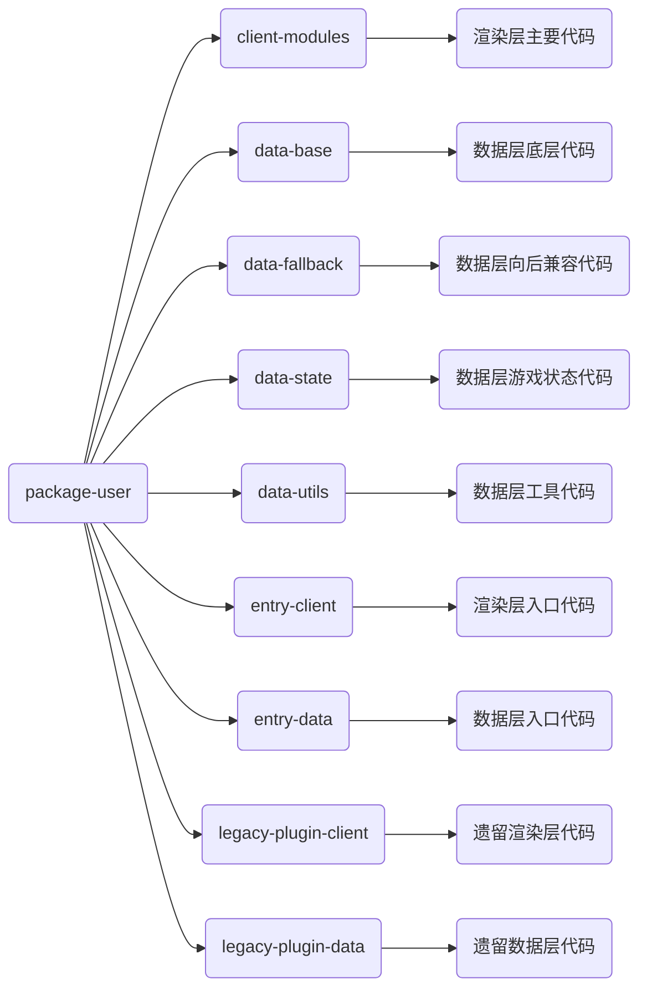

# 代码编写指南

本节将介绍如何在 2.B 样板中正确编写代码

## 在哪编写代码？

我们推荐在 `packages-user` 中编写代码，在这里你可以享受到完整的类型支持与代码补全。展开 `packages-user` 文件夹，可以看到里面分为了多个文件夹。我们应该主要在 `client-modules` 和 `data-state` 中编写代码，分别是渲染层和数据层的主要代码位置。其余内容一般是系统底层相关的代码，如果看不懂的话不建议修改。

## 如何使用模块化引入？

在引入时，需要**严格**遵循如下原则：

1. 同一模块间使用相对路径引入 `./xxx`
2. 不同模块间使用绝对路径引入 `@user/xxxx`

例如，如果你在 `@user/client-modules` 中引入自身的代码，就需要使用 `import { xxx } from './xxx`，如果你需要在 `@user/client-modules` 引入 `@user/data-base` 中的代码，就需要使用 `import { xxx } from '@user/data-base'` 引入。

:::warning
注意，在之后的所有文档示例中，都会使用 `import xxx from '@xxx/xxx'` 的绝对路径形式作为示例，而不会使用相对路径，自己编写代码时请注意要引入的内容是否在当前模块（当前包）中，如果是，请使用相对路径，否则请使用绝对路径。
:::

## 使用 TypeScript

所有代码使用 `TypeScript` 编写，后缀名为 `.ts` 或 `.tsx`，其中前者表示一般代码，后者表示 UI 代码（即包含 XML 的代码）

编写代码时，需要保证类型正确。如果搞不明白类型系统，类型就写 `any`（但是极其不推荐！这会使得自动补全也消失！）

`TypeScript` 类型系统教程可以查看[我编写的教程](https://h5mota.com/bbs/thread/?tid=1018&p=3#p41)

## 渲染层与数据层分离

渲染层可以直接引用数据层代码，但是数据层**不能**直接引用渲染层代码，具体请查看[系统说明](./system.md#渲染端与数据端通信)

## 避免循环引用依赖

需要避免两个包之间循环引入。如果出现了循环引入，请考虑将它们挪到一个包里面，或者将循环的部分单独拿出来作为一个包。
