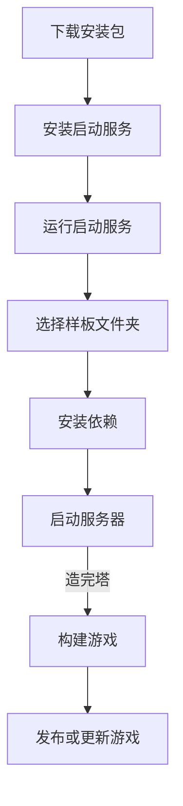

# 快速开始

本章节主要帮助你快速上手 2.B 样板。

## 常见需求实现指南

参考[此文档](./implements/index.md)

## 热重载

2.B 样板支持热重载，允许一些内容在不刷新页面的情况下就可以直接更新，包括 UI、怪物数据、道具数据等。例如，你在编辑器里面修改了一个怪物的攻击并保存，这时候进入游戏界面，可以直接看到地图上的怪物伤害变化了（怪物手册等 UI 中的怪物数据需要重新打开一次 UI 才会更新）。

## 启动游戏与编辑器

在造塔群中的群文件中找到 `启动服务->2.B+ 启动服务`，根据自己设备的系统下载对应的启动服务（此版本不支持移动端造塔），下载后运行安装到自己的设备，可以选择安装路径。

安装完毕后，打开软件，在左侧点击选择文件夹，然后打开 2.B 样板文件夹，即包含 `package.json` `packages` `packages-user` 这些目录的文件夹，打开错了会提示打开错误。

然后点击右侧的安装依赖，耐心等待一段时间，等待依赖安装完毕。

然后点击右侧的启动服务器，等待服务器启动，启动完毕后会自动使用默认浏览器打开游戏、编辑器和帮助文档。

当你**制作完游戏**后，点击构建游戏，即可自动构建游戏，构建结果在 `dist` 文件夹，会自动打包到 `dist.zip` 压缩包，发塔或更新上传此压缩包即可。

此帮助文档远比 2.x 的文档易读，也更容易理解，但是遇到问题时我们依然建议直接在造塔群询问，因为你可能不能判断文档中是否有关于你的问题的解答。

## 编辑器

编辑器与 2.x 的编辑器差别不大，但 2.B 的编辑器多了一些功能：

- 图片支持 `webp` 格式
- 音频支持 `opus` 格式
- 新增自动元件自定义连接
- 部分事件有改动

:::info
由于 `opus` 格式的音频在体积上有其他音频格式无可比拟的优势，因此建议所有音频使用 `opus` 格式。同样，由于 `webp` 格式的图片在多数情况下比 `png` `jpg` 格式更小，因此建议图片换用无损 `webp` 格式。
:::

### 代码编写

在 2.B 中，代码编写不再建议使用样板编辑器，因为在插件编写或脚本编辑中调用新接口较为复杂，且无法体验到代码补全、类型检查等实用功能。为了能有更好的开发体验，建议使用 `vscode` 等软件开发，如果不了解 `vscode`，建议查看[这篇文章](https://h5mota.com/bbs/thread/?tid=1018&p=1#p3)，这篇文章介绍了 `vscode` 的安装与一些必要插件的安装。或者当你用 `vscode` 打开样板时，`vscode` 也会提示推荐安装的插件，全部安装即可。

相比于 2.x，2.B 的 `main.js` 允许在 `function main` 的声明之后使用 `ES6+` 语法。

### TypeScript 类型检查

`TypeScript` 提供了非常严格的类型检查功能，这可以避免九成因粗心而犯的错误，包括变量名拼写错误、参数传递错误等。`TypeScript` 是 `JavaScript` 的超集，也就是说你可以在 `ts` 中写 `js` 代码，在语法上完全合理。如果不了解 `ts`，可以查看[我编写的教程](https://h5mota.com/bbs/thread/?tid=1018&p=3#p41)，不过由于难度较大，如果不能理解也不会有影响，你完全可以在 `ts` 中写 `js`，然后将所有的类型标记为 `any`，虽然这不规范，但是也确实可以避免类型报错。

## 游戏构建

由于 2.B 使用了与 2.x 完全不同的技术栈，它并不能直接在浏览器上运行，必须经过构建步骤。2.B 提供了一个新的启动服务来运行样板，它包含两个部分，一部分是开发服务器，这部分运行你直接开发，而不经过构建步骤，包括热重载等非常实用的功能；另一部分是构建，当你做完游戏后，点击构建按钮即可开始构建。需要注意的是，构建要求整个项目没有类型错误，如果包含类型错误，则会在输出中提到（`eslint` 报错不影响）。构建流程基本如下：

1. 构建代码
2. 压缩字体
3. 资源分离压缩
4. 将游戏压缩为 `zip` 压缩包

构建流程的自动化程度极高，因此你可以完全专注于游戏的制作，而完全不用关心资源加载等问题（也不需要添加分块加载插件）。

### 构建代码

2.B 的代码分为两部分，一部分是客户端（渲染端），另一部分是数据端（服务端），其中客户端会单向引用数据端，而数据端不能直接引用客户端，必须通过必要的接口。这么做是为了让渲染与数据分离，所有的必要逻辑运算都在数据端，这也意味着录像验证只会运行数据端，而不会运行客户端，因此客户端不应该出现会影响录像正确性与一致性的操作。

由于系统无法判断一个模块属于客户端还是数据端，因此构建时会打包两次：第一次以客户端为入口打包，包含客户端及数据端两部分；第二次以数据端为入口打包，只包含数据端。当在线游戏时，会以客户端入口打开游戏，当录像验证时，会以数据端入口来验证。

因此，必须要注意的是数据端不能直接引用任何客户端内容，这会直接导致录像验证报错，因为数据端打包也把客户端打包了进去，这是绝对不能出现的情况！而且样板没有办法来检测是否出现了这种情况！如何在数据端引用客户端内容请查看[此文档](./system.md#渲染端与数据端通信)

### 压缩字体

字体会使用 `Fontmin` 工具自动压缩，它会扫描项目中所有使用到的文字（不包括代码注释中的，也不包括使用 `String.fromCharCode` 方式创建的文字），然后处理字体，将所有不包含的文字的字体数据排除在外，只包含出现过的文字。这个操作可以大大降低字体大小。

### 资源分离压缩

类似于插件库的分块加载优化，不过 2.B 样板的实现与插件完全不同。样板会将所有资源混合打包，即图片可能会与音效打包在同一分块中。每个分块的大小默认为 `2MB`，可以在 `scripts/build-game.ts` 中修改。

### 压缩游戏

在上述操作执行完毕后，样板会自动处理一些剩余杂项，然后将打包结果放在 `dist` 文件夹中，此文件即为打包结果，可以直接用旧样板的启动服务打开。除此之外，样板还会自动将此文件夹压缩为 `zip` 压缩包，如果需要更新游戏或发塔，直接上传此压缩包即可，不需要任何额外处理。

### 协议问题

2.B 样板换用了 `GPL3.0` 开源协议，这要求所有以此为基础开发的项目也必须完全开源，但考虑到很多作者不了解其中的细节，因此样板将会针对此问题自动处理，处理方案为：**将源码原封不动地打包为压缩包，放到构建完成的游戏中**，届时，只要在网站上下载游戏，就可以解压压缩包查看源码及开源协议。

同时，这也意味着，如果你使用本样板开发游戏，其他任何人都可以以你的游戏为基础进行二次开发，而不需要你本人同意。如果不想让素材也能被别人使用，可以单独针对素材使用其他协议（如 `CC` 协议，可以上网查询具体信息），而不使用 `GPL3.0` 协议，但代码必须遵循 `GPL3.0` 协议。

## 学会查阅此文档

此文档内容很丰富，大部分接口文档都有使用示例，善用此文档可以大幅提高开发效率。
