# 系统说明

本文将介绍 2.B 的系统都做了哪些更改

## 模块化

2.B 样板现在已经迁移至了 monorepo，将代码模块化，共分为 20 余个模块，每个模块的具体内容可以参考 API 文档，模块列表如下：

- [@motajs/client](../api/motajs-client/index.md) 渲染层代码
- [@motajs/client-base](../api/motajs-client-base/index.md) 渲染层底层代码
- [@motajs/common](../api/motajs-common/index.md) 渲染层和数据层通用代码
- [@motajs/legacy-client](../api/motajs-legacy-client/index.md) 遗留渲染层代码
- [@motajs/legacy-common](../api/motajs-legacy-common/index.md) 遗留通用代码
- [@motajs/legacy-system](../api/motajs-legacy-system/index.md) 遗留渲染层系统代码
- [@motajs/legacy-ui](../api/motajs-legacy-ui/index.md) 遗留 UI 相关代码
- [@motajs/render](../api/motajs-render/index.md) 渲染系统代码
- [@motajs/render-core](../api/motajs-render-core/index.md) 渲染系统核心代码
- [@motajs/render-elements](../api/motajs-render-elements/index.md) 渲染系统内置元素代码
- [@motajs/render-style](../api/motajs-render-style/index.md) 渲染系统样式代码
- [@motajs/render-vue](../api/motajs-render-vue/index.md) 渲染系统 vue 支持代码
- [@motajs/system](../api/motajs-system/index.md) 渲染层系统代码
- [@motajs/system-action](../api/motajs-system-action/index.md) 渲染层交互系统代码
- [@motajs/system-ui](../api/motajs-system-ui/index.md) 渲染层 UI 系统代码
- [@motajs/types](../api/motajs-types/index.md) 渲染层类型代码
- [@user/client-modules](../api/user-client-modules/index.md) 用户渲染层主要代码
- [@user/data-base](../api/user-data-base/index.md) 用户数据层底层代码
- [@user/data-fallback](../api/user-data-fallback/index.md) 用户数据层向后兼容代码
- [@user/data-state](../api/user-data-state/index.md) 用户数据层状态代码
- [@user/data-utils](../api/user-data-utils/index.md) 用户数据层工具代码
- [@user/entry-client](../api/user-entry-client/index.md) 用户渲染层入口
- [@user/entry-data](../api/user-entry-data/index.md) 用户数据层入口
- [@user/legacy-plugin-client](../api/user-legacy-plugin-client/index.md) 用户遗留渲染层代码
- [@user/legacy-plugin-data](../api/user-legacy-plugin-data/index.md) 用户遗留数据层代码

## Mota 全局变量

与 2.A 不同，2.B 对 `Mota` 全局变量做了简化，不再拥有 `Mota.Plugin` `Mota.Package` `Mota.requireAll` 属性与方法，它们全部整合至了 `Mota.require` 方法中，同时该方法的用法与 2.A 也不同，在 2.A 中，我们往往使用 `Mota.require('var', 'xxx')` 的方式调用，繁琐且不直观。在 2.B 中，我们可以直接填入模块名称，就可以获取到其内容了，例如：

```ts
const { hook, loading } = Mota.require('@user/data-base'); // 获取 hook 与 loading
const { Font } = Mota.require('@motajs/render'); // 获取 Font 字体类
```

我们只需要填写一个参数，而不需要填写两个参数了，更加直观，而且与 ES6 模块语法类似，便于转换。

多数情况下，我们是不需要使用 `Mota` 全局变量的。不过，还是有一些特殊情况需要使用该全局变量才可以，这些情况包括：

- 在数据端调用渲染端接口，数据端需要跑录像验证，因此不能直接引入渲染端接口，需要通过此全局变量才可以。
- 在 `libs` `functions.js` 中调用接口，这两个地方暂时还没有模块化，因此无法直接引入，需要通过此全局变量调用。

## 渲染端与数据端通信

一般情况下，渲染端**可以**直接引入数据端的内容，例如你可以在 `@user/client-modules` 里面直接引入 `@user/data-state` 的接口，这是没有问题的。不过，由于数据端需要在服务器上跑录像验证，因此**不能**直接引入渲染端的内容，否则会导致验证报错。如果需要在数据端引用渲染端接口，我们需要这么做：

```ts
// @user/data-state 中的某文件
const num = 100;
Mota.r(() => {
    // 使用 r 方法包裹，这样这个函数就会在渲染端运行，可以有返回值，但是在录像验证中只会是 undefined
    const { Font } = Mota.require('@motajs/render');
    const font = new Font('Verdana', 18);
    // 函数内也可以调用外部变量，例如这里就调用了外部的 num 变量，但是极度不推荐在渲染端修改数据端的内容
    // 否则很可能导致录像不能运行，这里这个例子就会导致录像运行出错，因为录像验证时并不会执行这段代码，
    // 勇士的血量也就不会变大，于是就出错了。
    core.status.hero.hp += num;
});
```

除此之外，我们还可以使用钩子来进行数据通信。示例如下：

```ts
// 渲染端和数据端都可以使用这个方式引入
import { hook } from '@user/data-base';
// 也可以通过 Mota.require 方法引入
const { hook } = Mota.require('@user/data-base');

// 监听战后函数，每次与怪物战斗后，都会执行这个函数
// 每个钩子的参数定义可以参考 package-user/data-base/src/game.ts GameEvent 接口
hook.on('afterBattle', enemy => {
    console.log('与怪物战斗：', enemy.id);
});
```

## 加载流程

与 2.A 相比，加载流程也不太一样，下面是 2.B 的加载流程：

1. 加载 `index.html`
2. 加载 2.x 样板的第三方库

3. 如果是游戏中，加载 `src/main.ts`
    1. 加载渲染端入口
    2. 加载数据端入口
    3. 并行初始化数据端与渲染端，在数据端写入 `Mota` 全局变量
    4. 数据端初始化完毕后执行 `loading.emit('dataRegistered')` 钩子，渲染端初始化完毕后执行 `loading.emit('clientRegistered')` 钩子
    5. 二者都初始化完毕后执行 `loading.emit('registered')` 钩子
    6. 执行数据端各个模块的初始化函数
    7. 执行渲染端各个模块的初始化函数

4. 如果是录像验证中：
    1. 加载数据端入口
    2. 初始化数据端，写入 `Mota` 全局变量
    3. 初始化完毕后执行 `loading.emit('dataRegistered')` 与 `loading.emit('registered')` 钩子
    4. 执行数据端各个模块的初始化函数

5. 执行 `main.js` 初始化
6. 加载全塔属性
7. 加载 `core.js` 及其他 `libs` 中的脚本
8. 加载完毕后执行 `loading.emit('coreInit')` 钩子
9. 开始资源加载
10. 自动元件加载完毕后执行 `loading.emit('autotileLoaded')` 钩子
11. 资源加载完毕后执行 `loading.emit('loaded')` 钩子
12. 进入标题界面

使用流程图表示如下：



## 函数重写

在 2.B 模式下，如果想改 `libs` 的内容，如果直接在里面改会很麻烦，而且两端通讯也不方便，因此我们建议在 `package-user` 中对函数重写，这样的话就可以使用模块化语法，更加方便。同时，2.B 也提供了函数重写接口，他在 `@motajs/legacy-common` 模块中，我们可以这么使用它：

```ts
// 新建一个 ts 文件，例如叫做 override.ts，放在 client-modules 文件夹下
import { Patch, PatchClass } from '@motajs/legacy-common';

// 新建函数，这个操作是必要的，我们不能直接在顶层使用这个接口
export function patchMyFunctions() {
    // 创建 Patch 实例，参数表示这个 Patch 示例要重写哪个文件中的函数
    // 如果需要复写两个文件，那么就需要创建两个实例
    const patch = new Patch(PatchClass.Control);

    // 使用 add 函数来重写，第一个参数会有自动补全
    // 如果要重写的函数以下划线开头，可能会有报错
    // 这时候需要去 types/declaration 中对应的文件中添加声明
    patch.add('getFlag', (name, defaultValue) => {
        // 重写 getFlag，如果变量是数字，那么 +100 后返回
        const value = core.status?.hero?.flags[name] ?? defaultValue;
        return typeof value === 'number' ? value + 100 : value;
    });
}
```

然后，我们找到 `client-modules` 文件夹下的 `index.ts` 文件，然后在 `create` 函数中引入并调用 `patchMyFunctions`，这样我们的函数重写就完成了。**注意**，如果两个重写冲突，会在控制台弹出警告，并使用最后一次重写的内容。

**渲染端和数据端均可以调用此接口来重写函数！**

::: warning
**注意**，在渲染端重写的函数在录像验证中将无效，因为录像验证不会执行任何渲染端内容！
:::

## 目录结构

我们建议每个文件夹中都有一个 `index.ts` 文件，将本文件夹中的其他文件经由此文件导出，这样方便管理，同时结构清晰。可以参考 `packages-user/client-modules` 文件夹中是如何做的。

## ES6 模块化语法

我们推荐使用 ES6 模块化语法来编写代码，这会大大提高开发效率。下面来简单说明一下模块化语法的用法，首先是引入其他模块：

```ts
import { Patch } from '@motajs/legacy-common'; // 从样板库中引入接口
// 引入本地文件，注意不要填写后缀名，只可以在同一个 packages-user 子文件夹下使用
// 不可以跨文件夹使用，例如 packages-user/client-modules 就不能直接引用 packages-user/data-base 文件夹
// 需要使用 import { ... } from '@user/data-base'
import { patchMyFunctions } from './override';
```

:::warning
注意，在之后的所有文档示例中，都会使用 `import xxx from '@xxx/xxx'` 的绝对路径形式作为示例，而不会使用相对路径，自己编写代码时请注意要引入的内容是否在当前模块（当前包）中，如果是，请使用相对路径，否则请使用绝对路径。
:::

然后是从当前模块导出内容：

```ts
// 导出函数
export function myFunc() { ... }
// 导出变量/常量
export const num = 100;
// 导出类
export class MyClass { ... }
// 从另一个模块中导出全部内容，即将另一个模块的内容转发为当前模块
export * from './xxx';
```

更多模块化语法内容请查看[这个文档](https://h5mota.com/bbs/thread/?tid=1018&p=3#p33)

与 TypeScript 相关语法请查看[这个文档](https://h5mota.com/bbs/thread/?tid=1018&p=3#p41)
