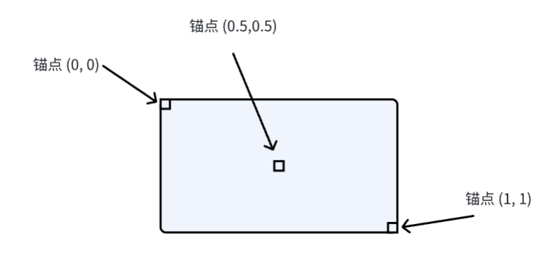

# UI 元素

本节将会讲解 UI 系统中常用的渲染元素以及基础使用。

## 通用属性

UI 元素包含很多通用属性，我们先来介绍这些属性，它们可以用在任何渲染元素和 UI 组件中。

### 定位属性

元素包含若干定位属性，其中最常用的是 `loc` 属性，我们也推荐全部使用这个属性来修改元素定位。其类型声明如下：

```ts
type ElementLocator = [
    x?: number,
    y?: number,
    w?: number,
    h?: number,
    ax?: number,
    ay?: number
];
```

这些属性两两组成一组（`x, y` 一组，`w, h` 一组，`ax, ay` 一组），每组可选填，也就是说 `x` 和 `y` 要么都填，要么都不填，以此类推。

- `x` `y`: 元素的位置，描述了在没有旋转时元素的锚点位置，例如 `[32, 32]` 就表示这个元素锚点在 `32, 32` 的位置，默认锚点在元素左上角，也就表示元素左上角在 `32, 32`。
- `w` `h`: 元素的长宽，描述了在没有缩放时元素的矩形长宽，默认是没有放缩的。
- `ax` `ay`: 元素的锚点位置，描述了元素参考点的位置，所有位置变换等将以此点作为参考点。0 表示元素最左侧或最上侧，1 表示最右侧或最下侧，可以填不在 0-1 范围内的值，例如 `[-1, 1]` 表示锚点横坐标在元素左侧一个元素宽度的位置，纵坐标在元素下边缘的位置。



示例如下：

```tsx
// 元素相对于 32, 32 位置居中（锚点在元素正中间），宽高为 64
<sprite loc={[32, 32, 64, 64, 0.5, 0.5]} />
```

除了 `loc` 属性之外，还可以通过设置 `anc` 属性来修改锚点位置，示例如下：

```tsx
// 设置锚点，效果为靠右对齐，上下居中对齐
<sprite anc={[1, 0.5]} />
```

你还可以手动指定 `x` `y` `width` `height` `anchorX` `anchorY` 属性，但是这种方式比较啰嗦，并不建议使用：

```tsx
<sprite x={32} y={32} width={64} height={64} anchorX={0.5} anchorY={0.5} />
```

最后说明一下元素的 `type` 属性，此属性描述了元素的定位模式，默认为 `static` 常规定位，此定位模式下元素位置会按照上述内容更改，而在 `absolute` 模式下，不论怎么修改定位属性，它都会保持在左上角的位置，可能会在一些特殊场景下使用（极度不建议使用此属性，很可能在 2.B.1 版本就会将其删除）。

### 纵深属性

可以通过 `zIndex` 属性来调整一个元素的纵深。纵深描述了元素之间的重叠关系，纵深高的会处在纵深低的元素上方，同时也会阻碍交互事件向纵深低的元素传播。必要的时候，需要通过设置纵深属性来调整层级关系。未设置时，后面的元素会处在前面的元素之上。

```tsx
// 这个元素会处在上层
<sprite zIndex={10} />
// 这个元素会处在下层
<sprite zIndex={5} />
```

### 效果属性

效果属性包含 `filter` `composite` 及 `alpha` 三个属性。

`filter` 表示此元素的滤镜，参考 [CanvasRenderingContext2D.filter](https://developer.mozilla.org/zh-CN/docs/Web/CSS/filter)，可以填写内置函数或 svg 滤镜。默认不包含任何滤镜。示例如下：

```tsx
// 亮度变为 150%，对比度变为 120%
<sprite filter="brightness(150%) contrast(120%)" />
```

`composite` 属性描述了当前元素与在此之前渲染的元素之间的混合模式，参考 [CanvasRenderingContext2D.globalCompositeOperation](https://developer.mozilla.org/zh-CN/docs/Web/API/CanvasRenderingContext2D/globalCompositeOperation)，可以填写 26 个值。默认使用简单 `alpha` 混合，即 `source-over`。例如：

```tsx
// 使用加算方式叠加，两个颜色的 RGB 值分别相加得到最终结果
<sprite composite="lighter" />
```

`alpha` 属性描述了此元素的不透明度，1 表示完全不透明，0 表示完全透明。在叠加时，所有颜色都会乘以此不透明度后叠加。默认值是完全不透明，即 1。但需要注意的是，虽然 1 表示完全不透明，但是如果画布内容本身包含透明内容（例如一个半透明矩形），即使是 1 也会表现为透明，因为叠加时会乘以 1，不透明度不变。示例如下：

```tsx
// 一个半透明元素
<sprite alpha={0.5} />
```

### 缓存属性

可以通过 `cache` 和 `nocache` 属性来指定这个元素的缓存行为，其中 `nocache` 表示禁用此元素的缓存机制，优先级最高，设置后必然不使用缓存。`cache` 表示启用此元素的缓存行为，常用于一些默认不启用缓存的元素，优先级低于 `nocache`。这两个元素都不能动态设置，也就是说不能使用响应式来修改其值。示例如下：

```tsx
// 内部渲染内容比较简单，不需要启用缓存
<container nocache>
    <text />
</container>
// 路径较为复杂，因此启用 g-path 的缓存行为
<g-path path={veryComplexPath} cache />
```

### 元素溢出行为

溢出行为是指，当其子元素超出父元素的大小时，执行的行为。例如，假如父元素大小为 `200 * 200`，里面有一个子元素，大小为 `100 * 100`，位于 `(150, 50)` 的位置，这时候子元素的一部分就会超出父元素的范围。

在本渲染系统中，所有元素的默认溢出行为是裁剪，即不会显示任何溢出内容，注意调整容器的宽高。在 `nocache` 模式下，由于不受到缓存的约束，溢出内容依然会显示，不过不建议利用此特性来编写 UI，因为这种行为可能会在后续的更新中修改。

### 隐藏元素

可以使用 `hidden` 属性来隐藏元素：

```tsx
const hidden = ref(false);
// 一般使用一个响应式变量来控制隐藏行为，因为设置成常量没有任何意义
<sprite hidden={hidden.value} />;
```

### 交互属性

交互属性包括 `cursor` 和 `noevent`。前者描述了鼠标覆盖在当前元素上时的指针样式，参考 [CSS: cursor](https://developer.mozilla.org/zh-CN/docs/Web/CSS/cursor)。示例如下：

```tsx
// 鼠标放置在该元素上时使用小手样式
<sprite cursor="pointer" />
```

`noevent` 表明当前元素将不会触发任何事件，事件将会下穿至纵深更低的元素。示例如下：

```tsx
// 设置为 noevent 模式
<sprite zIndex={100} noevent />
// 这样的话这个 onClick 就可以正常触发了
<sprite zIndex={10} onClick={click} />
```

### 高清与抗锯齿

包含 `hd` `anti` `noanti` 三个属性，`hd` 表示是否启用高清，大部分元素是默认启用的，除了几个像素风为主的元素（地图渲染等）；`anti` 表示手动启用画布的抗锯齿行为，一般用于默认不启用抗锯齿的元素；`noanti` 表示手动关闭元素的抗锯齿行为，优先级高于 `anti`，一般用于像素风图片展示、图标显示等，同时也有助于提高渲染性能。

```tsx
// 关闭高清
<sprite hd={false} />
// 关闭抗锯齿
<sprite noanti />
// 启用地图渲染的抗锯齿
<layer anti />
```

### 元素变换属性

可以通过调整 `transform` 属性来修改元素的线性变换，包括平移、旋转、缩放。如果是简易的变换，可以使用 `rotate` `scale` 属性来修改旋转、缩放，使用 `loc` 来修改位置：

```tsx
// 旋转 90 度，横向放缩为 1.5 倍，纵向不放缩
<sprite rotate={Math.PI / 2} scale={[1.5, 1]} loc={[32, 32]} />
```

我们没有设置锚点属性，那么需要注意旋转后，`loc` 属性所标明的位置将不再是左上角的那个点，因为旋转后，原本在左上角的点将会变成右上角的点。旋转时，顺时针为正，逆时针为负。

使用上面这种方式时，没有办法指定变换的顺序。一般情况下，变换的顺序将会影响结果，例如先旋转，再放缩，和先放缩，再旋转，其结果是不同的。下面我们来讲解一下图形学中的 2D 矩阵变换的基本概念，以及如何使用 `transform` 属性。

### Transform 矩阵变换

大部分情况下用不到此属性，此属性理解难度较大，如果不是必须使用此属性，可以不看此小节。以下矩阵变换内容由 `DeepSeek R1` 模型生成，并稍作修改。

#### 为什么需要变换矩阵？

在 2D 图形学中，变换矩阵（3x3）可以统一表示以下基本变换操作：

- 平移（Translation）
- 旋转（Rotation）
- 缩放（Scale）
- 错切（Skew）

通过矩阵乘法可以将多个变换组合为单个矩阵运算，其通用数学表示为（列主序）：

$Transform=\begin{bmatrix} a & b & 0 \\ c & d & 0 \\ e & f & 1 \end{bmatrix}$

其中：

- `a,d` 控制缩放和旋转
- `b,c` 控制错切
- `e,f` 控制平移

#### 变换组合原理

矩阵乘法具有结合性但不具有交换性，变换顺序会影响最终效果，矩阵按从右到左的顺序应用变换：

最终矩阵 = 平移矩阵 × 旋转矩阵 × 缩放矩阵 × 原始坐标

#### Transform 类核心功能

首先创建其实例：

```ts
import { Transform } from '@motajs/render';

const trans = new Transform();
```

之后可以链式调用来修改矩阵：

```ts
// 链式调用示例
trans
    .setTranslate(100, 50)
    .rotate(Math.PI / 4)
    .scale(2, 1.5);
```

方法对比

| 方法类型 | 特点                       | 函数                                                 |
| -------- | -------------------------- | ---------------------------------------------------- |
| 叠加变换 | 在现有变换基础上叠加新变换 | `translate` `rotate` `scale` `transform`             |
| 直接设置 | 覆盖当前变换参数           | `setTranslate` `setRotate` `setScale` `setTransform` |

#### 关键方法详解

平移变换：

```ts
// 相对移动（叠加）
trans.translate(20, -10);
// 绝对定位（覆盖）
trans.setTranslate(200, 150);
```

旋转变换：

```ts
// 叠加旋转 45 度
trans.rotate(Math.PI / 4);
// 设置绝对旋转角度
trans.setRotate(Math.PI / 2);
```

缩放变换：

```ts
// X 轴放大 2 倍，Y 轴不变（叠加）
trans.scale(2, 1);
// 设置绝对缩放比例
trans.setScale(0.5, 0.8);
```

#### 高级功能

矩阵操作：

```ts
// 手动设置变换矩阵
trans.setTransform(
    1,
    0, // 缩放部分
    0,
    1, // 旋转部分
    100,
    50 // 平移部分
);
// 矩阵相乘（组合变换）
const combined = trans.multiply(otherTransform);
```

坐标变换：

```ts
// 将局部坐标转换为世界坐标，即计算一个坐标经过此变换矩阵计算后的位置
const worldPos = trans.transformed(10, 20);
// 将世界坐标转换回局部坐标，即计算一个坐标经过此变换矩阵逆转换后的位置
const localPos = trans.untransformed(150, 80);
```

#### 性能优化技巧

使用自动更新机制：

```ts
import { ITransformUpdatable } from '@motajs/render';

// 绑定可更新对象
class MyElement implements ITransformUpdatable {
    updateTransform() {
        console.log('变换已更新！');
    }
}

const element = new MyElement();
trans.bind(element); // 变换修改时自动触发 updateTransform
```

#### 最佳实践

推荐变换执行顺序：

1. 缩放（Scale）
2. 旋转（Rotate）
3. 平移（Translate）

```ts
// 正确顺序示例
trans
    .setScale(2)
    .rotate(Math.PI / 3)
    .setTranslate(100, 50);
```

组合复杂变换：

```ts
// 创建子变换
const childTrans = trans
    .clone() // 从 trans 复制一个相同的变换出来，以防止修改原变换
    .rotate(-Math.PI / 6)
    .translate(30, 0);

// 应用组合变换
const finalTrans = trans.multiply(childTrans);
```

#### 应用到元素

赋值给 `transform` 属性即可

```tsx
<sprite transform={finalTrans} />
```

#### 常见问题排查

1. 变换不生效？
    - 验证绑定的对象是否实现 `updateTransform`
    - 检查有没有把 `trans` 对象赋值给元素的 `transform` 属性

2. 性能问题
    - 避免高频调用 `setTransform`
    - 优先使用叠加方法代替矩阵直接操作
    - 利用 `clone()` 复用已有变换

## `sprite` 标签

`sprite` 标签是一个允许你自定义渲染内容的标签，它新增了一个属性 `render` 属性，允许你传入一个函数来执行自定义渲染。函数定义如下：

```ts
type RenderFn = (canvas: MotaOffscreenCanvas2D, transform: Transform) => void;
```

- `canvas`: 要渲染至的画布，一般直接将内容渲染至这个画布上
- `transform`: 当前元素的变换矩阵，相对于父元素，不常用

多数情况下，我们只会使用到第一个参数，`MotaOffscreenCanvas2D` 接口请参考 [API 文档](../../api/motajs-render-core/index.md)。下面是一个典型案例：

```tsx
const render = (canvas: MotaOffscreenCanvas2D) => {
    const { ctx, width, height } = canvas; // 获取画布上下文以及长宽
    ctx.fillStyle = '#d84'; // 设置填充样式
    ctx.fillRect(0, 0, width, height); // 绘制一个矩形
};
```

`sprite` 元素的应用场景并不算多，因为样板内置的各种元素已经足够丰富，此元素一般只会在一些特殊情况下或性能敏感情况下使用。

## `container` 标签

`container` 表示一个容器，它可以将一系列元素作为子元素并渲染。它并没有新增任何属性。如果你想渲染子元素，请务必使用此元素包裹，除此之外的大部分元素是不能渲染子元素的。

## `container-custom` 标签

`container-custom` 是另一种容器，它允许你自定义对子元素的渲染方案，对于特殊场景下有一定的作用，例如样板自带的 `Scroll` 组件就使用此标签实现。它新增了一个 `render` 参数，定义如下：

```ts
type CustomContainerRenderFn = (
    canvas: MotaOffscreenCanvas2D,
    children: RenderItem[],
    transform: Transform
) => void;
```

- `canvas`: 要渲染至的画布，一般直接将内容渲染至这个画布上
- `children`: 要渲染的子元素，按 `zIndex` 升序排列
- `transform`: 当前元素的变换矩阵，相对于父元素，不常用

典型案例如下：

```tsx
const render = (
    canvas: MotaOffscreenCanvas2D,
    children: RenderItem[],
    transform: Transform
) => {
    // 顺序遍历子元素，保证纵深关系正确
    children.forEach(v => {
        if (v.hidden) return; // 如果元素隐藏，则不渲染
        // 调用子元素的渲染函数，传入 canvas 和 transform 作为参数
        v.renderContent(canvas, transform);
    });
};

<container-custom render={render} />;
```

## `text` 标签

`text` 标签用于显示文字，它会自动计算文字的宽高并设置为元素宽高，因此不要手动指定宽高，否则可能会引起位置错误。它新增了这些属性：

```ts
interface TextProps extends BaseProps {
    /** 要渲染的文字 */
    text?: string;
    /** 文字的填充样式 */
    fillStyle?: CanvasStyle;
    /** 文字的描边样式 */
    strokeStyle?: CanvasStyle;
    /** 文字的字体 */
    font?: Font;
    /** 文字的描边粗细 */
    strokeWidth?: number;
}
```

典型案例如下：

```tsx
import { Font } from '@motajs/render';

<text
    // 文字内容
    text="这是一段文字"
    // 文字定位，不要填写宽高，如果需要填写锚点，可以使用 anc 属性或宽高填 void 0
    loc={[32, 32]}
    // 填充样式，纯白色
    fillStyle="#fff"
    // 描边样式，红色
    strokeStyle="#d54"
    // 字体，使用大小为 24px 的默认字体
    font={new Font(24)}
    // 描边宽度 3px，默认为 2px
    strokeWidth={3}
/>;
```

## `image` 标签

`image` 标签允许你显示一张图片，包含一个 `image` 属性，传入图片对象（注意不是注册图片名称）。用例如下：

```tsx
// 获取注册的图片
const img = core.material.images.images['myImage.png'];
// 显示图片
<image image={img} />;
```

## `icon` 标签

`icon` 标签用于显示一个图标，可以包含动画帧。它有如下参数：

```ts
export interface IconProps extends BaseProps {
    /** 图标 id 或数字 */
    icon: AllNumbers | AllIds;
    /** 显示图标的第几帧 */
    frame?: number;
    /** 是否开启动画，开启后 frame 参数无效 */
    animate?: boolean;
}
```

使用案例如下：

```tsx
// 显示绿史莱姆，开启动画
<icon icon="greenSlime" animate />
```

## `winskin` 标签

`winskin` 标签允许你显示一个 rpg maker 风格的背景图（window skin），它有如下参数：

```ts
export interface WinskinProps extends BaseProps {
    /** winskin 的图片 id */
    image: ImageIds;
    /** 边框大小 */
    borderSize?: number;
}
```

其中边框大小默认为 32，表示上边框和下边框加起来共 32 像素，即四周边框 16 像素宽。用例如下：

```tsx
// 使用 winskin.png 作为图片，四周边框宽度为 24 像素
<winskin image="winskin.png" borderSize={48} />
```

## 图形标签

本小节讲解图形相关的标签，以下内容由 `DeepSeek R1` 模型生成并稍作修改。

### 通用属性说明

所有图形元素均支持以下核心属性：

| 属性分类       | 关键参数                  | 说明                                                     |
| -------------- | ------------------------- | -------------------------------------------------------- |
| **填充与描边** | `fill` `stroke`           | 控制是否填充/描边（不同元素默认值不同）                  |
| **样式控制**   | `fillStyle` `strokeStyle` | 填充和描边样式，支持颜色等（如 `'#f00'`）                |
| **线型设置**   | `lineWidth` `lineDash`    | 线宽、虚线模式（如 `[5, 3]` 表示 5 像素实线+3 像素间隙） |
| **高级控制**   | `fillRule` `actionStroke` | 填充规则（非零/奇偶）、是否仅在描边区域响应交互          |

### 矩形 `<g-rect>`

矩形的定位直接使用 `loc` 即可，示例如下：

```tsx
// 基础矩形，矩形默认仅填充模式，因此如果需要描边的话需要手动指定 fill 和 stroke 参数
// 注意如果仅指定 stroke 参数的话，会变为仅描边形式
<g-rect loc={[100, 100, 200, 150]} fill stroke fillStyle="#f0f" lineWidth={2} />
```

### 圆形和扇形 `<g-circle>`

参数如下：

```ts
interface CirclesProps {
    radius: number; // 半径
    start?: number; // 起始弧度（默认0）
    end?: number; // 结束弧度（默认2π）
    /**
     * 圆属性参数，可以填 `[圆心 x 坐标，圆心 y 坐标，半径，起始角度，终止角度]`，是 x, y, radius, start, end 的简写，
     * 其中半径可选，后两项要么都填，要么都不填
     */
    circle?: CircleParams;
}
```

示例如下：

```tsx
// 完整圆形
<g-circle circle={[300, 200, 10]} fillStyle="skyblue" />
// 扇形（60度到180度）
<g-circle  circle={[400, 300, 40, Math.PI/3, Math.PI]} />
```

### 直线 `<g-line>`

核心参数：

```ts
interface LineProps {
    x1: number; // 起点X
    y1: number; // 起点Y
    x2: number; // 终点X
    y2: number; // 终点Y
    /** 直线属性简写参数，可以填 `[x1, y1, x2, y2]`，都是必填 */
    line: [number, number, number, number];
}
```

示例如下：

```tsx
// 普通直线
<g-line
    line={[50, 50, 200, 150]}
    strokeStyle="red"
    lineDash={[10, 5]} // 虚线样式
/>

// 带箭头的参考线
<g-line
    // 不使用简写形式
    x1={300} y1={80}
    x2={450} y2={220}
    lineCap="round"    // 端点圆形
    lineWidth={4}
/>
```

### 三次贝塞尔曲线 `<g-bezier>`

核心参数：

```ts
interface BezierProps {
    sx: number; // 起点X
    sy: number; // 起点Y
    cp1x: number; // 控制点1X
    cp1y: number; // 控制点1Y
    cp2x: number; // 控制点2X（三次贝塞尔）
    cp2y: number; // 控制点2Y
    ex: number; // 终点X
    ey: number; // 终点Y
    /** 三次贝塞尔曲线参数简写，可以填 `[sx, sy, cp1x, cp1y, cp2x, cp2y, ex, ey]`，都是必填 */
    curve: BezierParams;
}
```

示例如下：

```tsx
// 三次贝塞尔曲线
<g-bezier
    curve={[100, 100, 150, 50, 250, 200, 300, 100]}
    strokeStyle="purple"
    lineWidth={3}
/>;

// 动态路径
const path = computed(() => [
    startX.value,
    startY.value,
    control1X.value,
    control1Y.value,
    control2X.value,
    control2Y.value,
    endX.value,
    endY.value
]);
<g-bezier curve={path.value} />;
```

### 二次贝塞尔曲线 `<g-quad>`

核心参数：

```ts
interface BezierProps {
    sx: number; // 起点X
    sy: number; // 起点Y
    cpx: number; // 控制点X
    cpy: number; // 控制点Y
    ex: number; // 终点X
    ey: number; // 终点Y
    /** 二次贝塞尔曲线参数，可以填 `[sx, sy, cpx, cpy, ex, ey]`，都是必填 */
    curve: QuadParams;
}
```

示例如下：

```tsx
// 二次贝塞尔曲线
<g-bezier
    curve={[100, 100, 250, 200, 300, 100]}
    strokeStyle="purple"
    lineWidth={3}
/>;

// 动态路径
const path = computed(() => [
    startX.value,
    startY.value,
    controlX.value,
    controlY.value,
    endX.value,
    endY.value
]);
<g-bezier curve={path.value} />;
```

### 圆角矩形 `<g-rectr>`

圆角矩形的核心参数与 CSS 的 border-radius 类似，如下：

```ts
interface RectRProps extends GraphicPropsBase {
    /**
     * 圆形圆角参数，可以填 `[r1, r2, r3, r4]`，后三项可选。填写不同数量下的表现：
     * - 1个：每个角都是 `r1` 半径的圆
     * - 2个：左上和右下是 `r1` 半径的圆，右上和左下是 `r2` 半径的圆
     * - 3个：左上是 `r1` 半径的圆，右上和左下是 `r2` 半径的圆，右下是 `r3` 半径的圆
     * - 4个：左上、右上、左下、右下 分别是 `r1, r2, r3, r4` 半径的圆
     */
    circle?: RectRCircleParams;
    /**
     * 椭圆圆角参数，可以填 `[rx1, ry1, rx2, ry2, rx3, ry3, rx4, ry4]`，
     * 两两一组，后三组可选，填写不同数量下的表现：
     * - 1组：每个角都是 `[rx1, ry1]` 半径的椭圆
     * - 2组：左上和右下是 `[rx1, ry1]` 半径的椭圆，右上和左下是 `[rx2, ry2]` 半径的椭圆
     * - 3组：左上是 `[rx1, ry1]` 半径的椭圆，右上和左下是 `[rx2, ey2]` 半径的椭圆，右下是 `[rx3, ry3]` 半径的椭圆
     * - 4组：左上、右上、左下、右下 分别是 `[rx1, ry1], [rx2, ry2], [rx3, ry3], [rx4, ry4]` 半径的椭圆
     */
    ellipse?: RectREllipseParams;
}
```

示例如下：

```tsx
// 四角圆角半径都为 10 的圆角矩形
<g-rectr loc={[0, 0, 200, 200]} circle={[10]} />
// 每个角都是横向半径为 10，纵向半径为 5 的椭圆
<g-rectr loc={[0, 0, 200, 200]} ellipse={[10, 5]} />
// 左上和右下是半径为 10 的圆角，左下和右上是半径为 25 的圆角
<g-rectr loc={[0, 0, 200, 200]} circle={[10, 25]} />
```

### 自定义路径 `<g-path>`

核心参数：

```ts
interface PathProps {
    path?: Path2D; // 自定义路径对象
}
```

示例：

```tsx
// 创建五角星
const starPath = new Path2D();
// ...路径绘制逻辑
<g-path
    path={starPath}
    fill
    stroke
    fillStyle="orange"
    strokeStyle="#c00"
    lineWidth={2}
/>;
```

### 最佳实践建议

1. 交互增强：

```tsx
<g-rect
    fill
    stroke
    actionStroke // 仅在描边区域响应点击
    onClick={handleSelect}
/>
```

2. 样式复用：

```tsx
// 创建样式对象
const themeStyle = {
    fillStyle: '#2c3e50',
    strokeStyle: '#ecf0f1',
    lineWidth: 2
};

<g-rect fill {...themeStyle} />
<g-circle stroke {...themeStyle} />
```

## API 参考

参考[API 文档](../../api/motajs-render-vue/index.md)，这里有更细致的 API 介绍。
